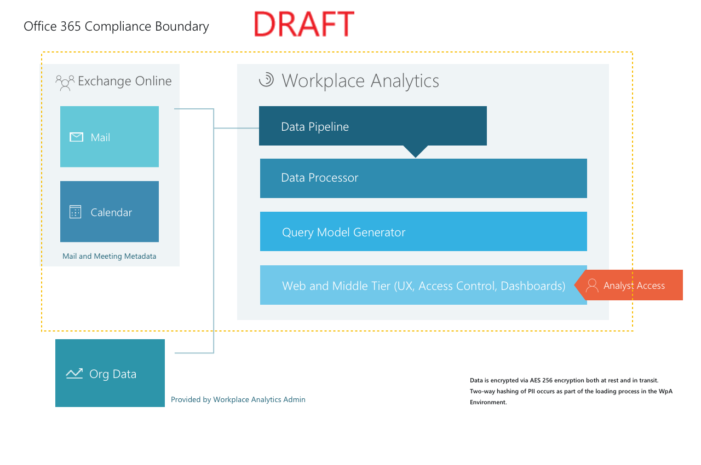

---
# Metadata Sample
# required metadata

title: Workplace Analytics - How it Works
description: This is a Checklist to introduce what is required to implement Workplace Analytics for your Organization
author: rodonahu
ms.author: rodonahu
ms.date: 01/19/2018
ms.topic: get-started-article
ms.prod: mya
---

# Architecture / How it Works

 

Workplace Analytics leverages Office 365 collaboration data to deliver powerful new insights for enterprise productivity. It provides a way for companies to understand the communication behaviors and collaboration patterns across their organization and how they influence productivity and corporate performance.

Workplace Analytics analyzes Office 365 [email and calendar header level metadata](Privacy-And-Data-Access.md) and combines it with organizational data from line of business applications.  By combining these datasets, analysts are able to provide a [variety of organizational insights](http://insights.office.com). All data is owned by the customer and stored within the O365 Compliance Boundary pursuant to the [Office 365 Compliance Framework](http://go.microsoft.com/fwlink/p/?LinkId=615657).

By design, Workplace Analytics provide organizations with choice:
* Our customers decide the scope of mailboxes to analyze.
* Our customers decide who within their organization has access to de-identified datasets and aggregated visual dashboards
* Our customers configure options to exclude specific meeting and email metadata from analysis as directed by their legal and HR teams

Our [Privacy and data access document](Privacy-And-Data-Access.md) describes these considerations in greater detail.

## Data Inputs
It is important to understand the data that is required to run the system, and the form that is generated that is accessed by analysts who can utilize the service.  The image below provides context into this. 

**Collaboration Data**|**Organizational Data**
:-----:|:-----:
Header information from emails|PersonId,Organization,ManagerId, Layer,Timezone,Level,Location, EffectiveDate|
Header information from Meetings|*At a minimum, the above data fields are required for the population scope that you are analyzing.*

By providing organizational data for the entire organization, an analyst can understand the internal collaboration points of the population they are analyzing. If an organization decides not to provide organizational data for parts of the organization, any collaboration data caluclated will be allocated to the N/A. group

>[!Important]
>Attachments and text in the body of emails and meetings are never used by Workplace Analytics.

## *Data Outputs* 

**Output type**|**Example**|**Role that has access**
-----|-----|-----
De-Identified Row Level Data|[ExamplePersonQuery.csv](~/images/WpA/Overview/ExamplePersonQuery.csv)|Analyst
Meeting Query Output|[ExampleMeetingQuery.csv](~/images/WpA/Overview/ExampleMeetingQuery.csv)|Analyst
Meeting Query output with subject lines encrypted|[ExampleMeetingHASHQuery.csv](~/images/WpA/Overview/ExampleMeetingHASHQuery.csv) |Analyst
Group Query|[ExampleGroupQuery.csv](~/images/WpA/Overview/ExampleGroupQuery.csv) |Analyst
-----|-----|-----
Visual Dashboards with Minimum Aggregation Threshold|need to add an image here|Analyst, Analyst (Limited)
Data Sources |need to add an image here |Administrator

The above image outlines the flow of data and how the outputs 

## Privacy Options
* Include Subject lines – As part of a meeting query, an administrator can choose to have meeting subject lines encrypted
* Minimum group size - By default our aggregated dashboards default to a minimum group size of 5, this can be increased to a larger number as needed

### Exclusion
All exclusion occurs before metadata is processed within the Workplace Analytics data engine
>[!Important]
>By default, Private meetings and email with digital rights management enabled are automatically excluded.

Customers can exclude any meeting or mail metadata based on the following parameters, (which may have impact on analysis):
* Subject lines – provide keywords to exclude from analysis
* Domains – exclude involving specific domains from the dataset
* Email addresses - exclude content involving specific email addresses from the dataset

## Data Handling
1. How is data de-identified
Workplace Analytics processes metadata from Office 365 email and calendar. Email addresses are never shown in Workplace Analytics through dashboards or query results. The Workplace Data Engine de-identifies by using a symmetric hashing to ensure that supplemental organizational data can be added when needed. Encryption keys are securely maintained by Microsoft only allowing programmatic access.
2. How is data Encrypted at rest and in transit
3. How are the Keys stored/can keys be managed by customer 
3. Describe data retention and deletion policy
4. What Certifications are in place for Workplace Analytics
5. What Region is Data Stored 
6. 

## Security
1. What kind of Penetration testing does Microsoft Have in place
2. What kind of audit logs exist as part of Office 365
3. How are Security Events handled 

### Related topics

[Configure settings for Workplace Analytics] (../use/settings.md) 

[Privacy and data access](Privacy-And-Data-Access.md)

### Is Workplace Analytics compliant with workers councils?

There is no compliance certification for such workers councils. Customers often have to work directly within each of their company's to ensure that Workers Councils are comfortable with the product and its use within the company. We strongly suggest you work with your internal legal and HR teams to respectfully engage with your Workers Councils.

