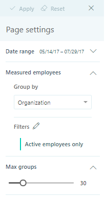

---
# Metadata Sample
# required metadata

title: Workplace Analytics overview
description: Gives a high-level overview of the main features and dashboards available in Workplace Analytics. 
author: madehmer
ms.author: madehmer
ms.date: 11/8/2018
ms.topic: get-started-article
localization_priority: normal 
ms.prod: wpa
---
# Start using Workplace Analytics

Microsoft Workplace Analytics is a cloud-based service that provides rich, actionable insights into your company’s communication and collaboration trends that help you make more effective business decisions.

Combining the organizational data that your company chooses to provide with email and calendar metadata from Office 365, Workplace Analytics enables analysts to provide business leaders with unprecedented insights about how people spend their time, and who they spend it with. These insights empower business leaders to drive strategies for sales, employee engagement, and productivity initiatives.

You can explore the data with the Workplace Analytics dashboards, and dive deeper into your company’s behavioral metrics by using custom queries and query templates that can be exported to enable offline analysis.

## Data analysis

Workplace Analytics gives you different ways to analyze and explore your data.

**Home** gives a high-level overview of collaboration and links to popular features.

[**Analyze**](../use/analyze-intro.md) provides data analysts with all the tools they need to explore collaboration trends and create custom queries for more specific data analysis.

[**Sources**](../use/data-sources.md) give you a deeper look at the data available for study within Workplace Analytics. You can see both Office 365 data and the organizational data you have imported for analysis.

[**Teamwork solution**](../tutorials/solutions-intro.md) enables teams to build better collaboration habits and master their time by using the combined power of Workplace Analytics and MyAnalytics. You can use Workplace Analytics to discover what challenges teams are struggling with, such as collaboration overload, and then enroll the teams in action plans with MyAnalytics to help address these challenges.

[**Settings**](../use/settings.md) enable you to customize system defaults and privacy settings. You must be an admin to access the Settings page.

**Page settings** for both the Explore and Solutions pages (open on the right side) enables you to change the date range, how to group measured employees, and the filter for active, inactive, or all employees. By default, the Explore and Solutions pages are filtered to show active employees only. Active employees are those who sent at least one email during the set date range (the aggregated time period set for the query or solution).

## Workplace Analytics playbooks

* The [Workplace Analytics Collaboration Overload Playbook](https://go.microsoft.com/fwlink/?linkid=2002306&clcid=0x409) explains how to develop informed strategies around changing organizational collaboration behavior and improving business outcomes.
* The [Workplace Analytics Workspace Planning Playbook](https://go.microsoft.com/fwlink/?linkid=2002305&clcid=0x409) quantifies the working relationships and habits of teams to optimize workspace allocation and improve employee connections and collaboration.