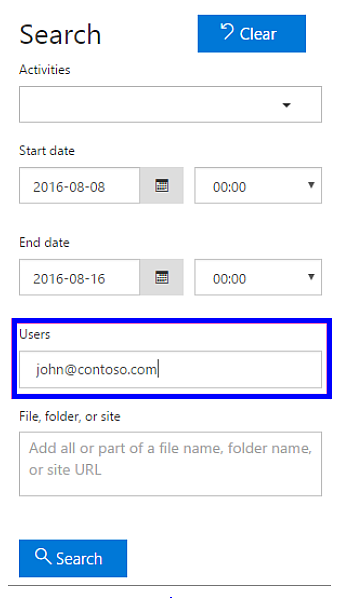
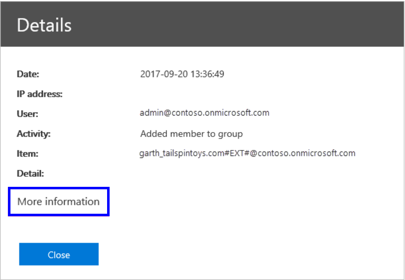

---
# Metadata Sample
# required metadata

title: Audit logs for Workplace Analytics  
description: Learn how to monitor Workplace Analytics activity with audit logs
author: madehmer
ms.author: v-midehm
ms.date: 06/13/2019
ms.topic: article
localization_priority: normal 
ms.prod: wpa
ms.collection: M365-analytics
manager: scott.ruble
audience: Admin
---

# Workplace Analytics audit logs

The Office 365 audit logs are generated and accessed in the Office 365 portal. As an Exchange admin, you can access these logs to audit or track general user activities and actions, such as to see who accessed, tried to access, or modified data.

These logs include an audit section for Workplace Analytics activity, which typically includes sensitive data. You can monitor and track your organizational data for all user actions to ensure compliance with your organization's privacy and security policies.

### Access requirements

You must meet the following requirements before you can access the audit logs:

* To access the auditing section of the Office 365 Security & Compliance Center, you must have an Exchange Online license (included with Office 365 Enterprise E3 and E5 subscriptions).
* And you must either be a Global admin or have an Exchange admin role that provides access to the audit log. Exchange admin roles are controlled through the Exchange Admin center. For more information, see [Permissions in Exchange Online](https://docs.microsoft.com/en-us/exchange/permissions-exo/permissions-exo).

### To access Audit log search

1. The audit logs are available through the Office 365 Security & Compliance Center. Go to [protection.office.com](https://protection.office.com).
2. Sign in to Office 365 with your admin credentials.

## To record activities for the audit logs

Before you can search the Office 365 audit log, you (or another admin) must first turn on audit logging:

1. Go to the **Security & Compliance** section on the **Home** page of the Office 365 portal,and then expand **Search & Investigation** in the left navigation pane.
2. Select **Audit log search**, and if available, select **Start recording user and admin activities**. (If you don't see this link, auditing is already turned on for your organization.)

   After you start recording, you'll see an "audit log is being prepared" message appear. It might take a few hours before you can search recorded activities in the audit logs.

## To view Workplace Analytics activities

1. In the **Security & Compliance** section on the **Home** page of the Office 365 portal, expand **Search & Investigation** in the left navigation pane, and then select **Audit log search**.

    

2. In the **Search** section of the **Audit log search** page, select to **Show results for all activities**.
3. In the **Start date** section, select a date range. 
   * To use the maximum date range of 90 days, select the current date and time for the start date. Otherwise, an error occurs about the start date being earlier than the end date. 
   * If you turned auditing on in the last 90 days, the date range can't start before auditing was turned on.
4. To return activities for all users (and service accounts), leave the **Users** field blank. Or you can enter one or more user names (the account email they use to log in to Workplace Analytics) in the **Users** field to only see those user activities.

    

5. In the **Search** field, enter **Microsoft Workplace Analytics Activities**, and then select **Search**. The following is a list of example activities.

    

6. The **Results** section of the **Audit log search** page shows a maximum of 5,000 of the most recent events, in increments of 150. Use the scroll bar in this section to show the next 150 events. This section lists the audit log events, including the following information. You can select a column header to sort the list by it.

   Column|Definition
   ------|-----------
   Date |The date and time (in UTC format) when the event occurred.
   IP address |The IP address that was used when the activity from a device was logged. The IP address is shown in IPv4 or IPv6 address format.
   User |The user (or service account) who performed the action that triggered the event.
   Activity |The activity performed by the user. This value corresponds to the activities that you selected in the Activities dropdown list. For an event from the Exchange admin audit log, the value in this column is an Exchange cmdlet.
   Item |The object that was created or modified because of the corresponding activity. For example, the file that was viewed or modified, or the user account that was updated. Not all activities in this column have a value.
   Detail |Any additional detail about an activity. Not all activities have a value.

   For more details and tips on searching, filtering, and exporting results in the audit log, see [Search the audit log](https://docs.microsoft.com/en-us/office365/securitycompliance/search-the-audit-log-in-security-and-compliance).

7. In the **Results** section, select an event from the list to view more details about it.
8. A **Details** page shows the event properties, which are based on which Office 365 service that the event occurred in. Select **More information** to view more.

    

## Workplace Analytics Activities

The following tables describe Workplace Analytics activities that the audit logs can record.

**Admin activities**

Activity |Description
-----|-----------
Uploaded org data |Admin uploaded organizational data file
Updated Privacy Setting |Admin updated settings
Updated data access setting |Admin updated data access settings

**Authorization activities**

Activity |Description
-----|-----------
User logged in |User logged in to Workplace Analytics with a valid [user role](../use/user-roles.md)
User logged out |User selected to log out of Workplace Analytics

**Query data access (analyst) activities**

Activity |Description
-----|-----------
Executed Query |Analyst ran a query
Cancelled Query |Analyst cancelled a running query
Delete Result |Analyst deleted a query result
Downloaded Report |Analyst downloaded a query result
Accessed OData link |Analyst accessed the OData link
Create Meeting Exclusion |Analyst created a new meeting exclusion rule
Updated Preferred Meeting Exclusion |Analyst updated the preferred meeting exclusion rule

**Explore data access activities**

Activity |Description
-----|-----------
Viewed Explore |Analyst viewed one or more Explore pages.

For more information about event properties, see [Detailed properties in the audit log](https://docs.microsoft.com/en-us/office365/securitycompliance/detailed-properties-in-the-office-365-audit-log).

## Use PowerShell to search the logs

You can also use PowerShell to access the audit logs based on your login. To use the New-PSSession command, your account must have:

* An Exchange Online license assigned to it.
* Access to the audit log for the Office 365 tenant.

The following example code uses the Search-UnifiedAuditLog command to get Workplace Analytics audit log entries.

      ```

       Set-ExecutionPolicy RemoteSigned
       $UserCredential = Get-Credential
       $Session = New-PSSession -ConfigurationName Microsoft.Exchange -ConnectionUri https://outlook.office365.com/powershell-liveid/ -Credential $UserCredential -Authentication Basic -AllowRedirection
       Import-PSSession $Session
       Search-UnifiedAuditLog -StartDate 1/1/2019 -EndDate 1/31/2019 -RecordType WorkplaceAnalytics-ResultSize 1000 | Format-Table | More

      ```
For more about connecting to Exchange Online, see [Connect to Exchange Online PowerShell](https://docs.microsoft.com/en-us/powershell/exchange/exchange-online/connect-to-exchange-online-powershell/connect-to-exchange-online-powershell?view=exchange-ps).
