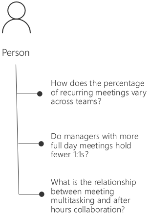
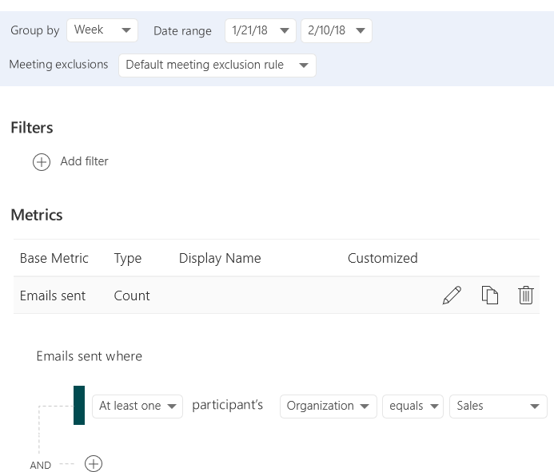

---
# Metadata Sample
# required metadata

title: Person queries in Workplace Analytics 
description: This topic describes how to use Person queries in Workplace Analytics to analyze the collaboration of individuals in your organization, from the point of view of each individual.     
author: rodonahu
ms.author: rodonahu
ms.date: 3/19/2018
ms.topic: get-started-article
localization_priority: normal 
ms.prod: wpa
---
# Person queries

The person query analyzes collaboration from the point of view of each individual in the organization.

That creates a lot of flexibility to analyze things like:
* How does time use vary by different organizational attributes?
* How do specific subgroups in the organization spend their time?
* How does one aspect of collaboration influence other time use habits?

 
The person query metrics fall within four broad categories.
And standard metrics from each category can be quickly added to your query.
Depending on your analysis, you can summarize a person’s collaboration metrics by day, week, or month.

Each query returns one row per person, per period.

The file will include any standard or customized metrics you specify.

 And your results will include any employee organizational data attributes that your Workplace Analytics admin has uploaded.

 
Analysts can use organizational attributes to further summarize the person results and can create powerful analyses that compare and contrast the collaboration of different groups in the organization.

 

## Create a person query

It’s simple to set up a person query.

* Select whether you want each person’s metrics summarized by day, week or month, and the period you’d like to analyze.
* If you want to exclude meetings from the calculations using custom criteria, you can select your custom rule set – otherwise, use the default.
* To help limit the size of the file you use for analysis, use filters to exclude certain rows from the output file based on the person’s organizational attributes.

 
## Customize metrics

You can customize most metrics. 

The options depend on the type of metric, but can include criteria related meetings and email. 

Meetings:
* When the event occurred
* How many people were involved
* Subject line keywords
* Attendee/organizer attributes

Email:
* When the email was sent
* How many people were included on the email
* Subject line keywords
* Recipient/sender attributes

For example, you can easily create a metric that gives you a count of each person’s emails where at least one person from the Sales organization was included.
 
 

Under **Display name**, the custom name for this metric _Emails sent to Sales_ will become the column header in the output file.

