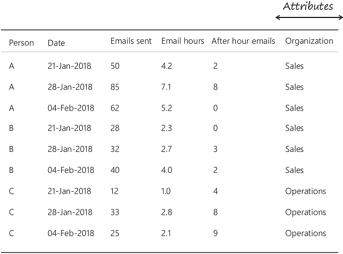
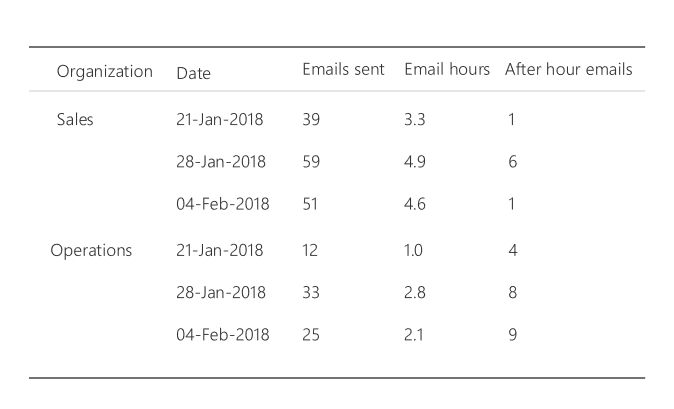

---
# Metadata Sample
# required metadata

title: Person queries in Workplace Analytics 
description: Describes how to use Person queries in Workplace Analytics to analyze the collaboration of individuals in your organization, from the point of view of each individual.     
author: madehmer
ms.author: madehmer
ms.date: 12/3/2018
ms.topic: get-started-article
localization_priority: normal 
ms.prod: wpa
---
# Person queries

The person query analyzes data from the point of view of each individual in the organization.

This creates a lot of flexibility in analyzing data. For example, you can learn:

* How time use varies by different organizational attributes?
* How specific subgroups in the organization spend their time?
* How one aspect of collaboration influences other time-use habits?

  

The person query metrics fall within four broad categories. You can add standard metrics from each category to your query. Depending on the analysis, you can summarize a person’s collaboration metrics by day, week, or month.

Each query returns one row per person, per period.

The file will include any standard or customized metrics you specify. The IsActive column in the output file is True if the employee sent at least one email during the specified time period for the query.

 And your results will include any employee organizational data attributes that your Workplace Analytics admin has uploaded.

You can use organizational attributes to further summarize the person results and create powerful analyses that compare and contrast the collaboration of different groups in the organization.

## Create a person query

It’s simple to set up a person query.

* Select whether you want each person’s metrics summarized by day, week or month, and the period you’d like to analyze.
* Select if you want active, inactive, or all employees included in the query. Active employees are those who sent at least one email during the set time period (the aggregated period set for the query).
* Select a custom rule set to exclude meetings from the calculations, otherwise it'll use the default.

## Add filters

You can use filters to exclude certain rows from the output file based on the person’s organizational attributes, such as size or function type.

The Organization filter can limit the query to those in the specified groups. For example, the following filter will only list people from the R&D and Engineering groups.

## Add metrics

You can add metrics to further customize your person query data. The options vary based on the type of metric, but can include criteria related to meetings and email.

Meetings:

* When the event occurred
* How many people were involved
* Subject line keywords
* Attendee/organizer attributes

Email:

* When the email was sent
* How many people were included on the email
* Subject line keywords
* Recipient/sender attributes

For example, you can add a metric to get an email count for each person where at least one person from the Sales organization is included in email.

 

You can add a filter to a base metric and edit the metric name with the filter. For example, the following shows _Emails sent to Sales_, which will be the column header in the output file.

To get more details on adding metric filters, see [Customize a metric](../Tutorials/customize-a-metric.md).

## Example person query for long meetings

You can create a person query to investigate if long meetings are a significant factor in the total number of meeting hours for Operations. The following custom query uses metrics and filters to customize the data.

**Query criteria**

* Time frame: Shows the data aggregated weekly
* Who: Filters on Operations
* What data: Metrics
  * Meeting hours are the total of all meeting hours
  * Long meeting hours that include long meetings that last 2 or more hours
  * Meetings is the total number of meetings
  * Emails sent is the total number of emails sent

### To create a custom person query for long meetings

1. In Workplace Analytics, select **Analyze** > **Queries** > **Person**.
2. Select and change **Enter query name here** to **Long Operations meetings** and enter a description.
3. For **Group by**, select **Week**, and then s
4. Select a date range. The query will analyze only the meetings that occurred during this date range.
5. In the **Meeting exclusions** menu, select the applicable exclusion rule set.
6. For **Included employees**, select if you want **Active only**, **Inactive only**, or **All employees** included in the query. Active employees are those who sent at least one email during the aggregated time period (date range) that you set for this query.
7. In the **Filters** section, select **Add filter**, and then in the menus, select **FunctionType** > **Equals** > **Operations**.
8. To add a metric for total meeting hours, in the **Metrics** section, select **Add metric**, and then select **Meeting hours**. Choose the Edit icon and change the metric's name to **Total meeting hours**.
9. To add a custom metric for long meeting hours, select **Add metric**, and then select **Meeting hours**. Choose the Edit icon and change the metric's name to **Long meeting hours**.

    a. To customize the Long meeting hours metric, select the Edit icon.
    b. Choose **Add filter**.
    c. In the **Long meeting hours where** section, select **Meeting**, and then select **Duration­Hours** > greater than or equal to > **2**.
    d. Select **Confirm**.

10. To add a metric for total number of meetings, select **Add metric**, and then select **Meetings**. Choose the Edit icon and change the name to **Total number of meetings**.
11. To add a metric for sent email, select **Add metric**, and then select **Emails sent**. Choose the Edit icon and change the metric name to **Number of emails sent**.

     > [!Notes]
     > * If no data exists for a person/date combination for a metric, the query results will not have a row for that person/date combination.
     > * When aggregating data by the week or the month, you might want to include a metric that has a zero value.
     > * To make sure you have a line of data for every person and date combination for the metrics, add **Emails sent** as one of your metrics.
     > * After you export the results, replace all null values with zeros to ensure that calculations for averages and other statistics include all person and date combinations.

12. Select **Run** at the top right to run the query.
13. On the **Queries** > **Results** page, the query status shows as **Submitted**. After the query status changes to **Succeeded**, you can view it, share it, download it (in .csv file format), delete it, or [Copy an OData link](https://docs.microsoft.com/en-us/workplace-analytics/use/view-download-and-export-query-results#get-a-link-for-odata-feed-that-you-can-use-in-power-bi) to use in a visualization tool, such as Power BI or Excel.

**Person query results**
The following are the columns included in the query results for the custom query created in the previous steps and an example of the type of data rows you might see:

* Person ID - De-identified ID number for the person represented in the metric.
* Date - The start date of the aggregation (i.e. if the week is 6/3 to 6/10, then it is 6/3. If it is a month, then it is the start of the month your data encompasses).
* Person Attributes - Each of the person attributes in the data set supplied by the organizational data.
* Metrics - Any other metrics that you included in the query.

**Person ID**|**Date**|**Person attribute 1 (department)**|**Person attribute 2 (role)**|**Metrics - Email hrs**|**Metrics Meeting hrs**
:-----:|:-----:|:-----:|:-----:|:-----:|:-----:
A|3/1/2017|HR|Administrator|5|11
B|3/1/2017|Marketing|Executive|4|14

## Related topics

[Metric descriptions](../Use/Metric-definitions.md)

[View, download, and export query results](../Use/View-download-and-export-query-results.md)