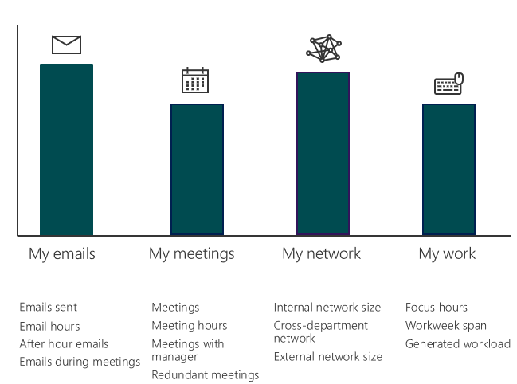

---
# Metadata Sample
# required metadata

title: Person queries in Workplace Analytics 
description: Describes how to use Person queries in Workplace Analytics to analyze the collaboration of individuals in your organization, from the point of view of each individual.     
author: madehmer
ms.author: madehmer
ms.date: 9/21/2018
ms.topic: get-started-article
localization_priority: normal 
ms.prod: wpa
---
# Person queries

The person query analyzes data from the point of view of each individual in the organization.

This creates a lot of flexibility in analyzing data. For example, you can learn:

* How time use varies by different organizational attributes?
* How specific subgroups in the organization spend their time?
* How one aspect of collaboration influences other time-use habits?

  

The person query metrics fall within four broad categories. You can add standard metrics from each category to your query. Depending on the analysis, you can summarize a person’s collaboration metrics by day, week, or month.

Each query returns one row per person, per period.

The file will include any standard or customized metrics you specify. The IsActive column in the output file is True if the employee sent at least one email during the specified time period for the query. 

 And your results will include any employee organizational data attributes that your Workplace Analytics admin has uploaded.

You can use organizational attributes to further summarize the person results and create powerful analyses that compare and contrast the collaboration of different groups in the organization.

## Create a person query

It’s simple to set up a person query.

* Select whether you want each person’s metrics summarized by day, week or month, and the period you’d like to analyze.
* Select if you want active, inactive, or all employees included in the query. Active employees are those who sent at least one email during the set time period (the aggregated period set for the query).
* Select a custom rule set to exclude meetings from the calculations, otherwise it'll use the default.

## Add filters

You can use filters to exclude certain rows from the output file based on the person’s organizational attributes, such as size or function type.

The Organization filter can limit the query to those in the specified groups. For example, the following filter will only list people from the R&D and Engineering groups.

## Add metrics

You can add metrics to further customize your person query data. The options vary based on the type of metric, but can include criteria related to meetings and email.

Meetings:

* When the event occurred
* How many people were involved
* Subject line keywords
* Attendee/organizer attributes

Email:

* When the email was sent
* How many people were included on the email
* Subject line keywords
* Recipient/sender attributes

For example, you can add a metric to get an email count for each person where at least one person from the Sales organization is included in email.

 

You can add a filter to a base metric and edit the metric name with the filter. For example, the following shows _Emails sent to Sales_, which will be the column header in the output file.

To get more details on adding metric filters, see [Customize a metric](../Tutorials/customize-a-metric.md).