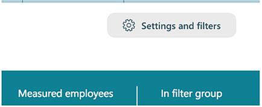
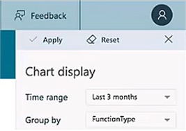
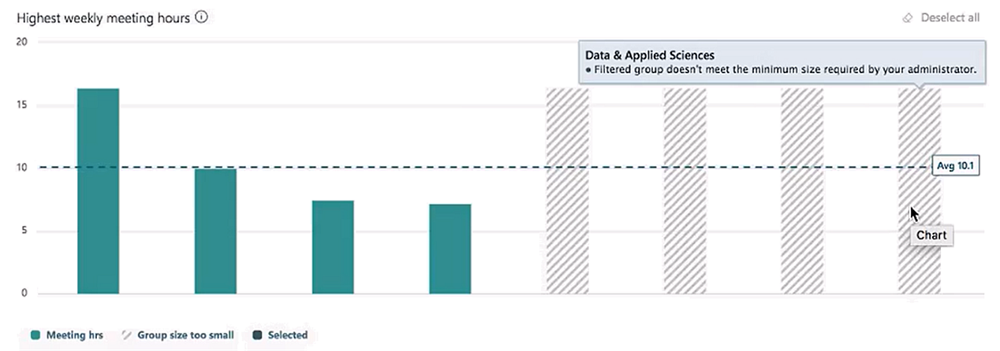
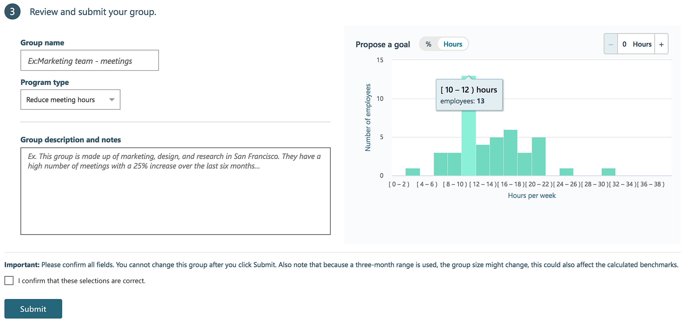
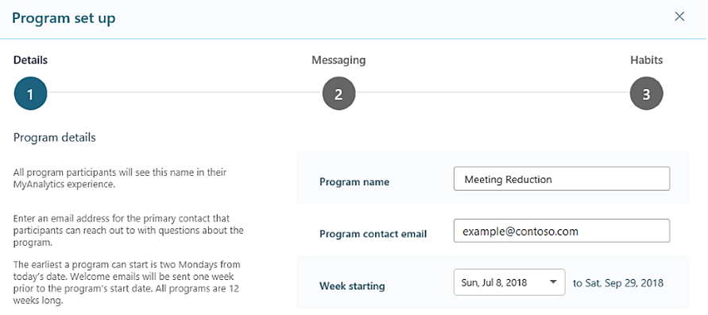
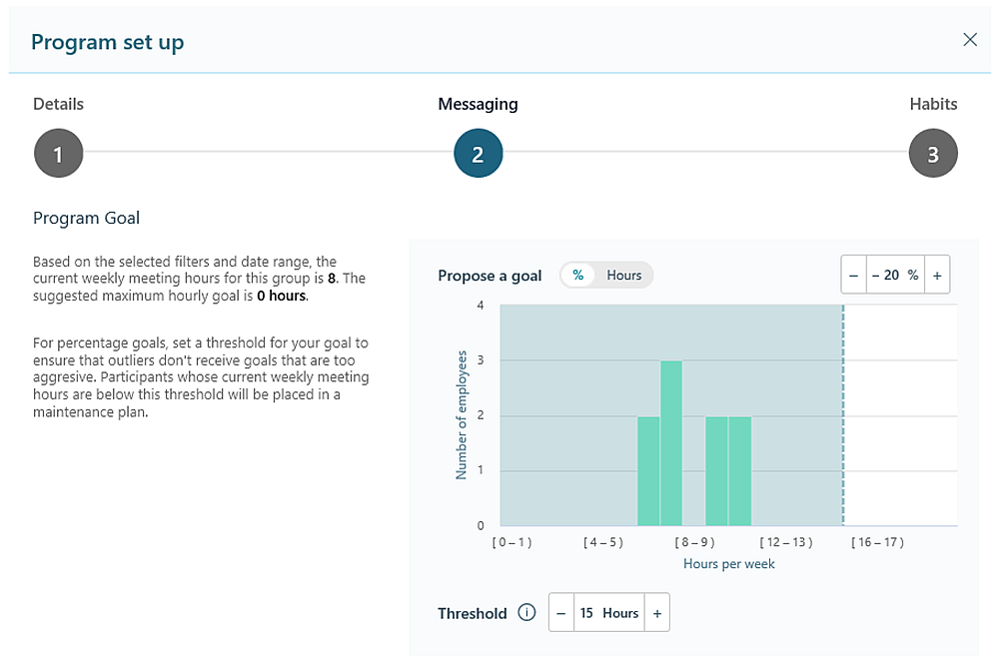
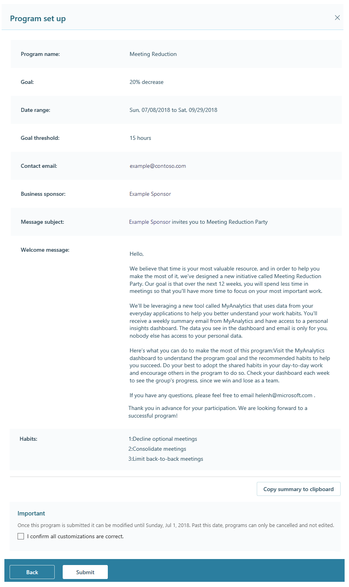

---
# Metadata Sample
# required metadata

title: Workplace Analytics Teamwork solution walkthrough
description: A walkthrough of the steps required to create a program by using the Workplace Analytics Teamwork solution
author: paul9955
ms.author: v-pascha
ms.date: 05/09/2019
ms.topic: article
localization_priority: normal 
ms.prod: wpa
---

# Teamwork solution walkthrough

Use the solutions area of Workplace Analytics to attempt to change employees' work habits for the better. On the Solutions pages of Workplace Analytics, you can create a program, track it while it is in progress, and examine it after it completes.

People in either of two roles can work on programs:

* Analysts can help identify groups and opportunities for change. 
* Program Managers can design and track programs that are underway and examine programs that have completed.

## Workflow phases, pages, and roles

Work on a program has the following phases:

| Workflow phase |Activity in this phase | Solutions page | Roles who can perform this activity |
| ---- | ---- | ---- | ---- |
| (1) [Identify](#identify-opportunities-for-improvement) | Identify a group that you want to take part in an improvement program.  | Identify | Both roles can identify users: Analysts can select groups, while Program Managers can manually upload groups. |
| (2) [Schedule](#schedule-a-program) | Define a program and assign it to a group. | Manage | Only Program Managers can define programs. Analysts have read access to the Manage page. |
| (3) [Track](#track-programs) | Track the group's progress in the program over its twelve-week length. | Track | Program Managers only. They have both read and write access to the Track page.  |
| (4) [Evaluate](#track-programs) | Compare how well a completed program did against its goals. | Track | The examination of completed programs is done primarily by Program Managers. |

## Identify opportunities for improvement

**Task role**: Analyst or Program Manager

The goal of the first phase in the solution workflow is to identify opportunities for improvement. An opportunity combines a group of people, a problem description, and a goal definition. You can create solutions that address problems in the areas of meeting hours, focus hours, or after hours.

In this first phase, start by submitting a group of people, or even multiple groups -- you can submit as many groups as you think might benefit. After a group is submitted, it enters a queue as a candidate for a change program. (In the next phase, [Schedule a program](#schedule-a-program), a Program Manager starts with a group and creates the change program for it.) 

Both analysts and Program Managers can create groups. You can create a group on the Solutions > Identify and Solutions > Manage pages. Analysts can use both pages, while Program Managers can use only the Manage page. The roles have different options, as follows:  

* **Analysts** can create a group either by using charts to select groups or by manually uploading a group (in a .csv file):

   * **Charts**: To use charts to select a group, on the **Solutions** > **Identify** page, you choose an area for behavior change, and then answer questions to perform an analysis of workplace behavior. Finally, use the results of this analysis to select one or more groups of people to put into an improvement program. For a step-by-step description, see [Identify a group](#identify-a-group).
   * **File upload**: To use an upload, you need to create a .csv file and then upload it. For a step-by-step description, see [Upload a file to create a group](#upload-a-file-to-create-a-group). For more information about the file you upload, see [Use a .csv file](solutionsv2-conceptual.md#use-a-csv-file).

* **Program Managers** can create groups only by manually uploading them. Use this method if you have a business reason to assign a program to a specific group of people. These people might recognize an area in which they want to improve, or you might have identified them as needing improvement in a certain behavior. The file you upload must have the .csv extension. You can assemble it by hand or export it from an HR tool. This file must use email addresses to identify people.
   * **File upload**: To use an upload, you need to create a .csv file and then upload it. See the following [Upload a file to create a group](#upload-a-file-to-create-a-group) for detailed steps. For more information, see [Use a .csv file](solutionsv2-conceptual.md#use-a-csv-file).

### Upload a file to create a group

 * **Task prerequisite:** Use this task if you already have a list (in the form of a .csv file) of people who will participate in the program. For more information, see [Use a .csv file](solutionsv2-conceptual.md#use-a-csv-file).  
 * **Task role**: Program Manager

1. In Workplace Analytics, select **Solutions** > **Identify** > **Go**.
2. In the **Custom group** card, select **Create**.
3. In the **Upload group** page, select **Browse**, locate and select a .csv file, and then select **Open**.
4. Identify this group in the **Group name** field.
5. For **Choose Program**, select the program type. The choice of a program is final; you cannot change it after you submit this group.
6. For **Max goal** (or **Min goal** if the program is to increase focus hours), select either a percentage-based or hours-based goal. If you select percentage-based, also set a value for **Threshold**. The choice of Max or Min goal is not final. See also [Set a value for Max or Min goal](solutionsv2-conceptual.md#set-a-value-for-max-or-min-goal).
7. Optionally, in the **Group description and notes** section, type a description of this group and the program.
8. Select the check box for **I confirm that these selections are correct** and then select **Submit**.
9. When Workplace Analytics shows your group as successfully uploaded, you can view groups that you've uploaded on the **Manage** page.

Go to [Schedule a program](#schedule-a-program).

### Identify a group

**Task role**: Analyst

If you don't yet have a list of people (a .csv file) that you want to register for the program, follow these steps. To get a list of participants, you use the options on the **Collaboration Overload** page for analysis.

> [!Tip]
> These steps works best if you start them after you decide the area of focus for your analysis. That is, if you know that some people in your organization have a problem with too many meeting hours, too few focus hours, or that they collaborate too much after the workday ends.

1. In Workplace Analytics, select **Solutions** > **Identify** > **Go**.
2. In the **collaboration overload** card for your area of focus (Meeting hours, Focus hours, or After hours), select **Get started**, which opens the **Collaboration Overload** page.
3. (Optional) Although you just selected an area of focus on the Identify page, if you decide that a different focus is better, you can change it on the **Collaboration Overload** page. To do this, select the text (such as focus hours) in the **Filter and analyze** banner:

   
 
4. Scope your data. To do this, narrow the focus to specific people by applying filters.

   > [!Note]
   > You apply filters in the Filter summary area, in the right column of the page. If this area is not showing, select **Settings and filters** to re-display it:

   
 
5. In the right column, under Filter summary, select **Edit**.
6. In the **Edit filters** panel, select **Add filter**. The following are example steps for adding a filter:

   a. In the left box, select **Organization**.
   b. In the right box, select a predefined organization, such as **Operations**.
      -- or --
      In the right box, start typing the name of a manager and then select the name of the manager's team.
   c. Optionally, you can add another organization filter. For example, select **Marketing** in the right box. If you do this, the Marketing filter selection is shown next to your first filter selection (such as Operations) in the selection boxes.

7. The results of this filtering are shown in a chart. Before Workplace Analytics displays the chart, you can optionally group the people whose behavior you are analyzing. You can also use any available HR attributes to group them by. To do this, in the Chart, select **Group by** and then select (for example) **FunctionType**.
8. To apply the filters and other changes that you've made, select **Apply**.

    

   Workplace Analytics shows a chart of the data about the people that you selected by using filters. It groups these people by the Group by setting you chose -- in this case, FunctionType.  

9. To select a more precise group of people to include in the program and continue with your analysis, you can use the **Select a question to change the view of your chart** options, such as: **Which groups attend the highest number of meetings?**

   Selecting a question shows the answer to the question in the chart. For example, if you select a question that is relevant to the collaboration problem that you want to solve, you will see groups of employees who are most likely to exhibit symptoms of that problem. Selecting a question also orders the groups shown by their metrics (such as meeting hours, focus hours, or number of meetings) based on what the question asks about.

   The chart has vertical bars that represent groups of people in the following ways:

   * Groups that reach or exceed the minimum group size are colored blue-green. These groups are large enough for you to analyze.
   * Groups that don't reach the minimum group size are displayed with gray and white stripes. These groups are too small to analyze individually. (Also see [Minimum group size](solutionsv2-conceptual.md#minimum-group-size).) For example, if the organization you are analyzing has a minimum group size of five, you can change it to a level that you consider more relevant for your organization. However, you cannot set the group size lower than five. In the following chart, the Data & Applied Sciences group contains fewer than five people, so its bar is shown as grayed out:

       
  
      See also [Available and selected employees](solutionsv2-conceptual.md#available-and-selected-employees).

10. Select one or more groups for analysis. You can also select grayed-out groups. If you select enough of them so that their combined membership exceeds the minimum group size, you can use them in your analysis.

    To select multiple groups, just click or tap them. To unselect a selected group, click or tap it again. For more information about what happens with selected groups when you make other settings on this page, see [Persistence of group selections](solutionsv2-conceptual.md#persistence-of-group-selections).

After you have identified the groups, do the following steps to [Submit a group](#submit-a-group).

### Submit a group

**Task role**: Analyst

1. After you have selected groups in [Identify a group](#identify-a-group), finish creating your program in the **Review and submit your group** section: 

   

2. Enter a group name and description, and optionally, change the program type, which is final after this step.

   > [!Important] 
   > The program type that you select here is final; it cannot be changed later.

3. Note the **histogram** under **Propose a goal** that displays the baseline state for the selected employees, according to the program type that you chose in the previous step. For example, if your program is "Reduce meeting hours," the columns in this histogram will show the distribution of employee behavior regarding meeting hours -- that is, the hours per week that the employees in the selected groups spent in meetings. This baseline state helps you choose a useful and reasonable goal for these employees.
4. Select a goal. You can pick either a time-based goal or a percentage-based goal:

    * **Time-based goal**: Select **hrs** and then select a number of hours. Participants will see this as the maximum number of meeting hours per week that they should strive to reach over the course of the program. (For Focus hours, this goal will reflect the minimum number of hours.)

    * **Percentage-based goal**: Select **%** and then select a percentage amount. Participants should reduce their meeting hours by this much (or, for Focus hours, to increase the number by this much). If you choose percentage-based, you can also select a threshold. For more information, see [Threshold](solutionsv2-conceptual.md#threshold). 

5. Select the check box for **I confirm that these selections are correct**, and then select **Submit**. A notification appears in the lower-right area of the page to confirm that your group was successfully submitted. You can select this notification to open and view the group on the **Solutions** > **Manage** page.

## Next steps: processing tasks

After you select **Submit**, Workplace Analytics processes the group. Processing includes the following tasks.

1. **Create the group**: If you manually uploaded the group, Workplace Analytics matches the provided email addresses to PersonIDs in the system. If you selected a group by using the Identify page, the system creates the group based on the measured employees who meet the criteria set by the filters you used and the groups you selected when the group was submitted. For more information about manual upload, see [Manually upload a .csv file](solutionsv2-conceptual.md#manually-upload-a-csv-file).
2. **Calculate the benchmark**: Workplace Analytics calculates a new benchmark for this program type and this group. For example, if you chose Reduce meeting hours as the program type, the calculated benchmark reflects the average amount of time these people spent in meetings over each week of the most recent 12 weeks of data that Workplace Analytics has for that group. 
3. **Display the group card**: Workplace Analytics displays the group in a card in the Unassigned groups column on the Solutions > Manage page. This card shows the group's title, program type, and date of submission. At first, the group's card indicates that the group is still being processed. After processing is finished, the displayed card is still just a group of people; it is not yet a program. (For more information about group and program cards, see [The Solutions > Manage page](solutionsv2-conceptual.md#the-solutions--manage-page).)  

> [!Note] 
> After processing is finished, both the size of the group and the calculated benchmark might differ from what you expect. For more information, see [Group size and benchmark might differ](solutionsv2-conceptual.md#group-size-and-benchmark-might-differ).

Go to [Schedule a program](#schedule-a-program). 

## Schedule a program

**Task role**: Program Manager

You schedule a program with the Manage page in Workplace Analytics. You can review submitted opportunities and focus on the ones best suited for a change program. You can then schedule change programs by specifying the goal, habits, and additional context. While programs are underway, you can review, edit, or cancel them.

**To schedule a program**

1. In the **Unassigned groups** column, hover over the group for which you want to schedule a program and select **Assign**. 
2. In the **Group summary** pane, confirm the program details about the group, such as its name, program type, size, and submitter. 
3. Optionally, select **Copy summary to clipboard** to copy this information. You can then share it with others and confirm the program details are as expected.
4. When you're ready to schedule the program, select **Customize**.
5. On the **Program setup** page, complete the required fields of **Program name**, **Program contact email**, and **Start date**, and then select **Continue**. Note: The program's end date (twelve weeks from the start date) is automatically set.

   

6. Workplace Analytics checks the following:

   * Are any participants already assigned to a different program for the selected time? People cannot participate in two programs at the same time, so these people would be ineligible for your program until their current program finishes.
   * Are any participants lacking a MyAnalytics license? MyAnalytics licenses are required for program participation.

7. If necessary, Workplace Analytics provides information for ineligible employees. For example, the following shows that six employees are ineligible because of a conflicting program.
  
   

8. For this issue, you can:

   * Change the program start date so that your program starts after the other program finishes and these six people are free of their obligation to the other program.
   * Or start your program at the originally planned date and accept the fact that these six people cannot participate. To do this, select the **I understand ...** check box, and then select **Continue**. Workplace Analytics recalculates the program benchmark for the final group of participants (the selected employees who are eligible during the entire twelve weeks).

   > [!Note] 
   > If excluding these people causes the group to fall below minimum group size, you cannot proceed. You'll need to choose a different start date or a new group of people. 

9. For the Messaging step on the **Program setup** page, you can change details about the program, such as the goal -- whether to express it as a percentage or as a number and how high a percentage or number. For example, it makes sense to reset the goal as shown because the benchmarks might have changed when the group lost ineligible employees.

   

10. Enter the name of your business sponsor, which can be the name of a person or, for example, a leadership team. At a minimum, include a message subject and a welcome message. The name of the business sponsor and the program name are included in the message subject.

11. Optionally, edit the message subject and/or the welcome message.

12. The Habits step on the **Program setup** page shows behavioral habits that pertain to the program goal. Select three habits based on what the team needs, such as what you found through your analysis. Alternatively, you can base it on a prior agreement among the team participants. After you've selected three habits, select **Continue**.

   

13. On the **Program Setup Summary** page, confirm the program details:
    * If you need to change anything, select **Back**. 
    * Or select the check box for **I confirm that these selections are correct** and then select **Submit**.

   

### The program starts

The program does not start immediately after you schedule it. Here are the events that lead up to the program-start date:

| Event | Notes |
| ----- | ----- | 
| Create and [schedule a program](#schedule-a-program) | <ul><li>After you submit the program, Workplace Analytics displays a message that tells you on which day the program will start.</li><li>On the Solutions > Manage page, the program's card moves from Unassigned groups to Scheduled programs.</li></ul> | 
| The next Monday arrives | <ul><li>Programs always start on a Sunday. On the Monday before that first Sunday, Workplace Analytics sends the welcome email (see an [example](solutionsv2-participants.md#welcome-email)) to all program participants. (You had an opportunity to edit this welcome email in [Schedule a program](#schedule-a-program).)</li><li>After Workplace Analytics sends the welcome message to the new participants, the program is locked for editing.</li></ul> |
| The next Sunday arrives | <ul><li>This is the first day of the first week (of twelve weeks) of the program.</li><li>The program's card moves from Scheduled programs into Active programs.</li></ul> |

In this sequence of events, if you schedule a program on -- for example -- a Wednesday, the soonest the program can start is two Sundays later.

After the program starts, you can track its progress in the following [Track programs](#track-programs).

## Track programs

**Task role**: Program Manager

You can track programs on the Manage page. Use this page to measure progress on the goal since program started, as well as ROI for the program. For a brief overview, see [The Solutions > Manage page](solutionsv2-conceptual.md#the-solutions--manage-page).  

**To track an active program**

1. In the **Active programs** columnn on the **Solutions** > **Manage** page, hover over a program's card to display the **Track** option:

   
 
2. Select **Track** to show information about the progress of the program up to this point. For more information, see [Progress report](solutionsv2-conceptual.md#progress-report).

3. Optionally, to compare the results of one program (active or completed) with the results of another program (active or completed), select the **Progress for** list in the banner, and then select the name of the other program. The display switches to the progress for the selected program.

4. Optionally, if applicable, you can end the program before its twelve weeks have passed. To do so, select **End program** on the **Results** page. If you select **End program**, you see a warning dialog box that asks you to confirm that you really want to end the program. 

## Related topics

[Solution: Introduction](solutionsv2-intro.md)  

[Solution: Participants](solutionsv2-participants.md)  

[Solution: Concepts](solutionsv2-conceptual.md)
