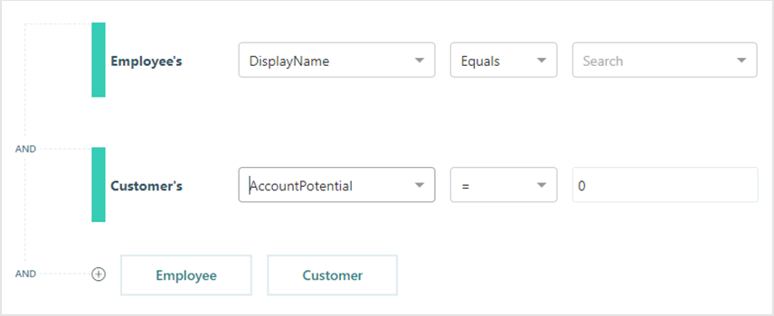

---
# Metadata Sample
# required metadata

title: CRM queries in Workplace Analytics 
description: Describes how to use Queries to analyze CRM data in Workplace Analytics 
author: madehmer
ms.author: v-midehm
ms.date: 05/22/2019
ms.topic: article
localization_priority: normal 
ms.prod: wpa
---
# Queries with CRM data

After you've successfully uploaded and processed your company’s Customer Relationship Management (CRM) data in Workplace Analytics, you can use person-to-group and group-to-group queries to do combined organizational and CRM data analysis, such as:

* Analyze the time your sales or other teams spent with accounts and the network size for accounts as defined in your CRM.(Today you currently can get time spent and network size by using specific domains.)
* Analyze collaboration data with CRM contacts and customize the metrics by any CRM attribute you choose to upload, such as contact level, contact function, contact location, contact first and last name, and so on.
* Analyze collaboration data with CRM accounts and customize the metrics by any CRM attribute you choose to upload, such as account tier, account geography, account revenue potential, and account name.

## Person-to-group queries

Person-to-group queries in Workplace Analytics help you understand how an individual invests their time across the rest of the organization and with your CRM contacts, accounts, and sellers. The query results list individuals ("time investors") by their PersonIDs (de-identified), one or more groups that you define in the query ("their collaborators"), and the amount of time that the time investor spends with the groups that you define. 

To learn more about time allocation, general information about, and step-by-step instructions on how to create these queries, see [Person-to-group queries](../Tutorials/person-to-group-queries.md).

## Group-to-group queries

Group-to-group queries in Workplace Analytics give results that help you understand how a team invested their time across the rest of the organization and with CRM accounts, contacts, and sellers. The query results list pairs of groups, as defined by the organizational and CRM attributes that you choose, along with how much time people in the first group (the "time investors") allocated to other groups ("collaborators").

For example, if CRM data is available, you could analyze how much time your sales team (AccountOwners and Sellers) spent with customers (CRM AccountType = Customer) as compared to time spent on other (non-customer) collaboration, as shown in the following graphic.

To learn general information about and step-by-step instructions on how to create these queries, see [Group-to-group queries](../Tutorials/group-to-group-queries.md).

## Data analysis examples

After you have successfully [uploaded and processed CRM data](../setup/crm-data-upload.md) in Workplace Analytics, you'll see the following additional options when creating person-to-group or group-to-group queries. 

* In the **Time investors** section, you can optionally filter the results to include specific time investors from both your CRM data and Organizational (HR) data.

* If you mapped your CRM seller and account data to account owners during the upload process, you can filter sellers or sales teams based on account attributes for the accounts they are assigned in the **Time investors** section.

  For example, the following graphic shows an employee filter of **FunctionType** > Equals > **Sales** *and* customer filters of **IsAccountOwner** or **IsSeller** > Equals > **True**, which will include query results for employee time investors in Sales and customer time investors in one of these two CRM roles.

   

* In the **Their collaborators** section, you can add customer attributes to exclude groups or group collaborators by specific attributes, such as Accounts or AccountName. These are the same as for time investors.

  For example, the following graphic shows a customer filter of **AccountAnnualRevenue** > Less than > **1000**, which will exclude customers with less than that amount of annual revenue from the query results.

   

## Sample query output with CRM data

The following graphic shows example CRM data that you might see in the output .csv file.

   

## Related topics

[Person-to-group queries](../Tutorials/person-to-group-queries.md)

[Group-to-group queries](../Tutorials/group-to-group-queries.md)

[Metric descriptions](../Use/Metric-definitions.md)

[View, download, and export query results](../Use/View-download-and-export-query-results.md)
