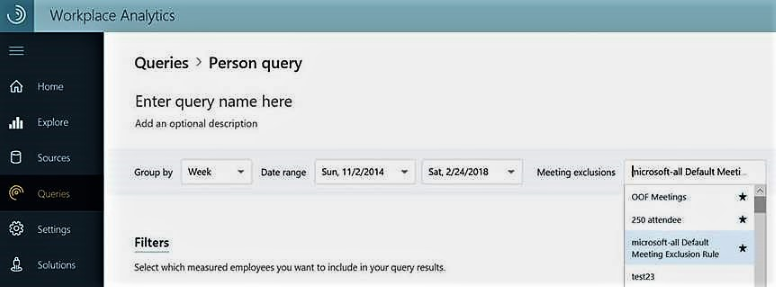

---
# Metadata Sample
# required metadata

title: Create custom meeting exclusions rules in Workplace Analytics
description: This topic contains step-by-step instructions to create meeting exclusions rules and run meeting exclusions queries in Workplace Analytics.
author: LeisaLaDell
ms.author: v-leash
ms.date: 02/14/2018
ms.topic: get-started-article
ms.prod: wpa
---
# Create custom meeting exclusions rules in Workplace Analytics

<!-- 
TEMPORARILY REMOVING THIS "PLACEHOLDER-TOPIC" NOTE. 26 MARCH 2018. 
VERIFY AND UPDATE THIS CONTENT. 
[[CONTENT NOTE: This is a placeholder topic. Update with new process from FastTrack.]]
-->

This topic contains step-by-step examples detailing how to work with meeting exclusions.

## How to create and run an “All meetings default” query using default meeting exclusions

In this task, you will create a query that lists all meetings not excluded by the default exclusions.
By default, Workplace Analytics excludes the following types of meetings from query results, as they are not likely to represent relevant workplace meetings:

* Meetings with only one attendee
* Meetings equal to or longer than eight hours
* Meetings with 50 or more attendees

In addition, Workplace Analytics will exclude meetings that are marked as Private, Confidential, or that are rights managed.

If you not yet created any meeting queries, review the Meeting queries section in the topic [Create queries in Workplace Analytics](../Use/Create-queries.md).

### To create and run an “All meetings default” query using default exclusions 
1. Create a new meeting query, named _All meetings default_.
2. In the **Meeting exclusions** menu, select **Default meeting exclusion rule**.
3. Under **Metrics**, click **Add metric**, and then add all the available metrics (Attendees, Attendee multitasking and so on) to the query.
4. Run the query.

## How to create and run a “Meetings excluded default” query
In order to evaluate the relevance of the default meeting exclusions for your company, you will need a list of those meetings that are excluded. To get that list, you will create and run a _Meetings excluded default_ query.

### To create a "Meeting excluded default" query
1. On the **Queries** page, on the **Queries** tab, click **Meeting exclusions**.
2. Follow these steps to create a meeting exclusions rule set that is the opposite of the default meeting:

    a. At the bottom of the page, click **Add exclusion**

    b. Under **Excluded meetings where**, in the filter menu, select **Total attendees > 1**, and then hover over that filter and click **AND**. 
    
    > [!Note] 
    > Use only AND clauses. Do not use OR clauses. 

    c. In the next filter, select **Total attendees < 250**, and then hover over that filter and click AND.

    d. In the next filter, select **Duration < 8**.

3. In the line above the filters, enter a name the exclusion rule (_Meetings excluded default_) and then click **Save**.
4. Go back to the **Queries** page and create a new query named A_ll Meeting Excluded Default_.
5. In the **Meeting exclusions** menu, select your meeting exclusion rule created in step 2 and named in step 3
6. Under **Metrics**, click **Add metric**, and then add all the available metrics (Attendees, Attendee multitasking and so on) to the query.
7. To run the query, click **Run**.
8. On the **Queries** page, on the **Results** tab, hover over the line for your report, and once the status is Succeeded, click **View** or **Download**.

## How to create custom meeting exclusions
After a review of the all meetings and default excluded meetings, you may decide to create custom meeting exclusion rules to more closely reflect your company’s meeting norms and culture.

[!INCLUDE [Create a custom meeting-exclusion rule](../Includes/to-create-custom-meeting-exclusion-rule.md)]

[!INCLUDE [Designate a meeting-exclusion rule as a favorite](../Includes/to-designate-meeting-exclusion-rule-as-favorite.md)]

Marking a rule as a favorite moves it to the top of the Meeting exclusions drop-down list on the query-creation page. In the following illustration, the "OOF Meetings" rule was marked as a favorite. It therefore appears at the top of the list: 

 

> [!Note] 
> You can designate more than one rule as a favorite. Each subsequent rule you mark as a favorite moves to the top of the list and pushes previously marked favorites down the list. 

## Business scenario: Include large meetings, exclude keywords
Company A has a flat organization, and 260-person meetings are the norm, but those meetings were excluded by the default meeting exclusions. Additionally, there is a culture of creating meetings with no other attendees to make time for focused work and prevent others from over-booking their calendar. After reviewing the meeting query results, the analyst noticed a theme that “No meeting block time” and “PTO time” were common subject lines of non-relevant meetings.

In this scenario, the analyst has decided to create custom meeting exclusion rules for her company with the following criteria:

* Keep the default exclusion rules for:
  * Total attendees: Exclude meetings with only one attendee.
  * Duration: Exclude meetings with duration greater than, or equal to, eight hours.
* To include meetings of 260 attendees, change Total attendees > 60 (increased from the default of 50).
* To exclude PTO time, create a keyword exclusion where subject = “vacation” or “PTO” or “holiday”

