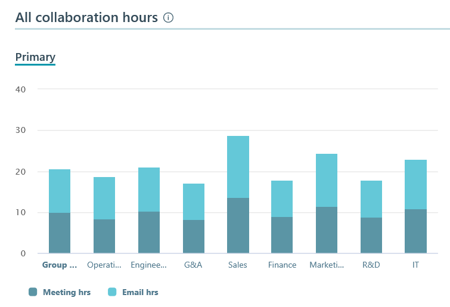
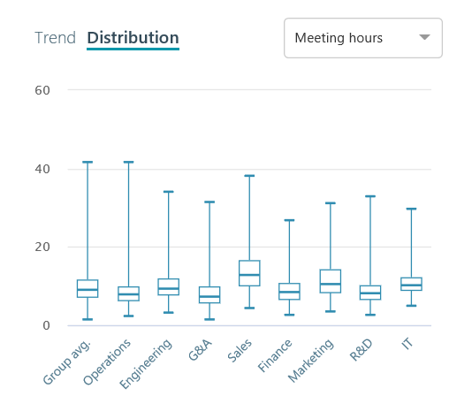

---
# Metadata Sample
# required metadata

title: Chart types in Workplace Analytics
description: Describes the different chart types and how to use the chart features in Workplace Analytics.

author: madehmer
ms.author: rodonahu
ms.date: 07/13/2018
ms.topic: get-started-article
localization_priority: normal 
ms.prod: wpa
---

# Chart types in Workplace Analytics

Workplace Analytics has several different chart types that can present your data in a variety of ways.

## About chart data

* By default, Workplace Analytics groups data by organization, and shows the average metric for the nine largest organizations in the chart, as well as the average for all groups (including any beyond the top nine)
* Your administrator can set a minimum group size threshold that is required for data to show in the chart. If the group size is less than the minimum, the group's data is excluded. You can see the name of the group, but not the values. When the size of a group equals zero, that group is not shown.
* To see different organizations, or other organizational attributes, use the filters in the **Chart display**.

## Bar charts
Bar charts compare data across groups. Each bar shows the average value for the metric, such as email or meeting hours per person per week in each group for the period selected. 

### To view the specific values for a group 
* Hover over the bar for the group to see its data.

### To hide or unhide a metric from the bar chart 
* In the legend below the chart, select the metric name to hide it. Select the metric name again to show it.

## Trend line charts
Trend line charts compare metric values over time. The default trend line is the company average. Each line shows the weekly average for the month for the Group by attribute value you have selected, over a rolling 13-month period. 

### To add a group trend line to the chart  
* Select the corresponding group bar in the adjacent bar chart. 

### To remove a group trend line from the chart, but keep it in the legend
* Select the corresponding text in the legend.

### To remove a group trend line from the chart completely 
* Select the corresponding bar in the adjacent bar chart.

### To reset all added lines from the chart and return to the default view 
*  Select **Reset**.

### To view the specific values for a date 
* Hover over the line on the date you want to see.

### To switch between the metrics (such as Emails or Meetings) 
* Select the text or menu above the chart.

## Distribution charts 
Distribution charts compare the distribution of metric values within a group. Each box plot shows the maximum, minimum, median, upper quartile, and lower quartile for the group for the period selected.

Each individual value within a group represents the average value for a person. For example, the person with the highest average is represented by the maximum point on the box plot.

### To view the distribution statistics for a group 
* Hover over the box plots for that group.

### To switch between metrics, such as emails and meetings
* Select the text above the chart.

## Chart Settings and filters

Use **Settings and filters** to change the time range of the data, to change the attribute to group in the charts, and to apply filters.

When you change chart display settings, your changes will apply to all the charts on all the tabs of **Explore Metrics**.
For example, when you set the chart display to group by _level_, all charts in all sections are grouped by taht level.

### To change the date range 
1. If needed, select **Settings and filters**. 
2. Under **Chart display**, in the **Time range** menu, select the period you want and then select **Apply**. 

[!Note]
The time range options encompass the most recent data loaded and uses the following logic.<ul><li>A week is defined as Sunday to Saturday, and date ranges are adjusted to span the first Sunday to last Saturday of the selected range.</li><li>For a week that starts in one month and ends in the following month, the data is associated with the month in which the week begins.</li></ul>

### To change how the charts are grouped
1. If needed, select **Settings and filters**. 
2. Under **Chart display**, in the **Group by** menu, select the organizational attribute that you want and then select **Apply**.

### To add filters 
1. If needed, select **Settings and filters**.
2. Under **Filter summary**, select **Add filter**, 
3. Add the filters that you want, and then select **Apply**.
