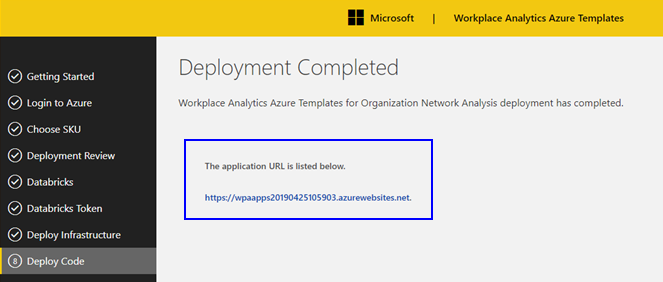

---
# Metadata Sample
# required metadata

ROBOTS: NOINDEX,NOFOLLOW
title: Deploy and configure the Workplace Analytics Azure Templates 
description: How to deploy and configure the Workplace Analytics Azure Templates
author: madehmer
ms.author: madehmer
ms.date: 12/14/2018
ms.topic: get-started-article
localization_priority: normal 
ms.prod: wpa
---
# Deploy and configure the Workplace Analytics Azure Templates

Before you can use the Workplace Analytics Azure Templates for advanced data analysis, review the security considerations for this deployment and then confirm or complete the following prerequisites, deployment, and configuration steps.

## Security considerations

Before installing these templates, review the following security principals for this deployment.

* Data is stored in your Azure subscription.
* Data is encrypted on disk and all access to and communication between the Azure Resources and these templates are enabled and secured with the Secure Sockets Layer (SSL) certification.
* Authentication leverages the Azure Active Directory.
* Authorization is set at the Azure Databricks and Azure Templates level by the Azure administrator that installs and sets up the Workplace Analytics Azure Templates.
* An Azure Template Configuration log is created during installation.

## Prerequisites

Before installing the Workplace Analytics Azure Templates, confirm or complete the following:

1. Confirm that [Workplace Analytics is set up](https://docs.microsoft.com/en-us/workplace-analytics/setup/set-up-workplace-analytics) and ready to use.
2. Enable [Workplace Analytics data access](https://docs.microsoft.com/en-us/workplace-analytics/data-access/data-access) for the Azure tenant.
3. Do the following for the Azure subscription that will host these templates and the data exported from Workplace Analytics:
   * Either an Azure Admin or an Azure Contributor role is required to deploy these templates.
   * Get [applicable Azure AD permissions](https://docs.microsoft.com/en-us/azure/active-directory/develop/active-directory-how-applications-are-added) for this same person from your Office 365 global administrator.
   * If the Workplace Analytics team is deploying the templates, confirm that vendor accounts are set up for the team and that the Technical Operations engineer has the applicable Azure permissions to install and set up the templates.

## Deployment

1. Get an Azure deployment link for the Workplace Analytics Azure Templates from the Workplace Analytics team.
2. When prompted, select the Azure subscription and region and select **Next**.
3. Select **Launch Workspace**.
4. You automatically get signed in to Azure Databricks. If you’re not, you need to manually sign in.
5. You then need to [generate the Azure Databricks Token](https://docs.azuredatabricks.net/api/latest/authentication.html#generate-a-token) for the App source.
6. On the **Summary** page, select a SKU for the data cluster, which must be about 30 percent larger than your Workplace Analytics data set (ask your Workplace Analytics Admin for help with this), for the following Azure components:
   * [Azure Resource Group](https://docs.microsoft.com/azure/azure-resource-manager/resource-group-overview#resource-groups)
   * [Azure Blob storage account](https://docs.microsoft.com/azure/storage/blobs/storage-blobs-introduction)
   * [Azure Databricks](https://docs.microsoft.com/azure/azure-databricks/)
   * [Azure SQL database](https://docs.microsoft.com/azure/sql-database/)
   * [Azure Analysis Services](https://docs.microsoft.com/azure/analysis-services/)
   * [Azure Web Apps (App Service)](https://docs.microsoft.com/azure/app-service/)
   * [Azure Key Vault](https://docs.microsoft.com/azure/key-vault/key-vault-use-from-web-application)
7. Select **Run** to deploy resources for the Azure components.
8. When the deployment succeeds, open, copy, and save the deployed website link for the templates, as shown in the following graphic.
   >[!Important]
   >You must save this deployed website link because you and the other users you add need it to configure and use the templates.

     

## Configuration

### Add users and assign roles

As the Azure Templates Admin, you need to add the other users and assign them one of the following roles based on what tasks they need to accomplish with the templates:

* **Azure Templates Admin**
  * Can add other users and assign roles for the templates.
  * Shares the templates website link with the other users.
  * Shares the link to access the [Azure Databricks Workspace](https://docs.azuredatabricks.net/user-guide/workspace.html) with the assigned Data scientists.

* **Analyst**
  * Can access, use, and customize the analytical templates available through the Workplace Analytics Azure Templates website link.
  * Can access, use, and customize the Power BI reports and dashboards connected to the Workplace Analytics Azure Templates.

* **Data scientist**
  * Can access, use, and customize the same analytical templates and Power BI reports and dashboards as the Analyst can access.
  * Can also access the Azure Databricks Workspace and use Python or R scripts to derive new insights.

**To add users and assign them roles:**

1. Use the website link (from the last step in Deployment) to open the Workplace Analytics Azure Templates.
2. Select **Admin page** > **User Management** > **Add New User**.
3. Type the email address for the user and select the applicable role for this user, as shown in the following graphic.

     

## Process the data

After adding users, you need to process the Workplace Analytics data that you want to use with these templates:

1. In Azure Resource groups, locate the folder that the deployment just created. The new resource group begins with **wpaappsrg** and will include the deployment date and time in the name, as shown in the following graphic.
  
   

    That new storage group contains a **rawdata** folder, as shown in the following graphic.

     

2. Confirm the following .csv files are in the new **rawdata** folder:
   * **MailParticipants.csv**
   * **Mails.csv, MeetingParticipants.csv**
   * **Meetings.csv**
   * **PersonalHistorical.csv**

   If these .csv files are not already in the **rawdata** folder, then you need to use the Azure Storage Explorer (or another comparable tool) to connect to the Azure storage group that currently stores your Workplace Analytics data set, and select and copy them into that folder.
3. In the Workplace Analytics Azure Templates app, select **Admin** > **Scenario Execution**, select the **rawdata** folder, and then select **Process data**.

   

## Get support

* For help with Workplace Analytics Azure Templates, email your questions or feedback to wpa-tops@microsoft.com.
* For setup and data analysis help with Workplace Analytics, open Workplace Analytics, select the **smiley face** icon (at the top of the UI), enter your question or feedback, and then select **Send**.
* For general help with Office 365 and Azure subscriptions, components, assigning licenses, and issues with user access and permissions, contact [Microsoft Support](https://support.microsoft.com/).

## Related topics

* [Workplace Analytics Azure Templates overview](./overview.md)
* [Organization Network Analysis Azure Template](./organization-network-analysis.md)
* [Topic Analysis Azure Template](./topic-analysis.md)