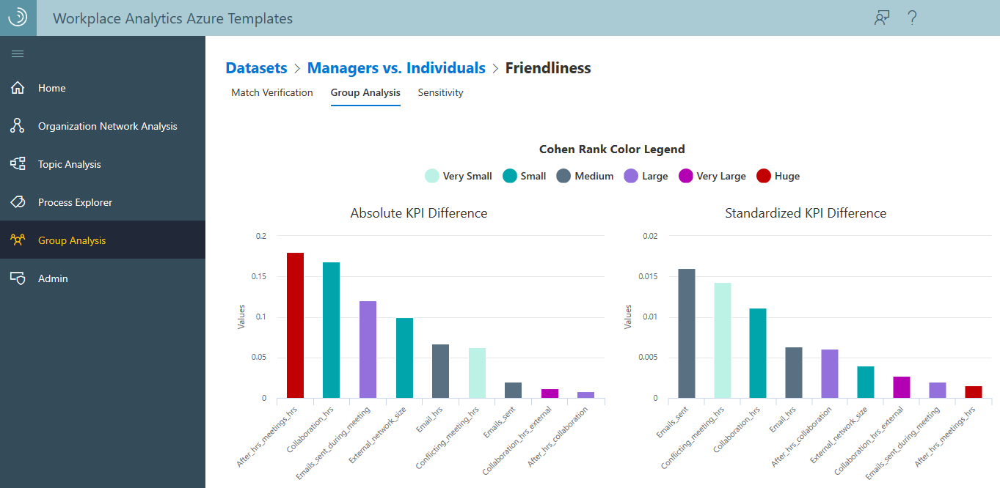

---
# Metadata Sample
# required metadata

ROBOTS: NOINDEX,NOFOLLOW
title: Group Analysis Azure Template for Workplace Analytics 
description: Learn about the Group Analysis Azure Template for Workplace Analytics and how to use it for advanced data analysis
author: madehmer
ms.author: v-midehm
ms.date: 06/19/2019
ms.topic: article
localization_priority: normal 
ms.prod: wpa
ms.collection: M365-analytics
manager: scott.ruble
audience: Admin
---
# Workplace Analytics Group Analysis Azure Template

_These templates are only available as part of a Microsoft service engagement._

Workplace Analytics Azure Templates includes the Group Analysis template that enables you to compare two groups, such as managers and individual contributors, and determine the major differences between them.

You can choose which metrics to analyze and which attributes remain the same between the groups to foster a more robust comparison. This type of analysis can help proactively discover and address areas that need improvement in your organization.

After you upload a dataset, you can use the template tools to view data for the two groups with visual charts and lists, as shown in the following graphic.

   

## To add a new dataset

1. In Workplace Analytics Azure Templates, select **Group analysis**.
2. Select **Add New Dataset** at top right of the table.
3. For **Upload Dataset**, type a dataset name, select the .csv file to upload, and then select **Upload Dataset**.

   

4. After the upload succeeds, it'll be available in the Group Analysis list.

## To configure new analysis

1. Select the new dataset from the list.
2. Select **Add New Analysis**.
3. In **Configure New Analysis**, type a name for the **Dataset Info**. 
4. In **Specify Group to compare**, select the filters for the group that you want to evaluate.
5. In **Choose Group name**, type a name for the group you want to evaluate.
6. In **Specify KPIs to compare the group on**, select all metrics that you want to compare between the evaluated group and the control group. 
7. In **Choose confounding attributes**, select the attributes that define the evaluated group and the control group and that the two groups have in common. Note these must be different than the filter or filters selected in the **Specify Group to compare** section.
8. Select **Run Analysis**.

## Analyze KPIs

You can use the analysis to view the key performance indicators (KPIs) between the defined group you chose to analyze and the control group you're comparing with.

## Related topics

* [Workplace Analytics Azure Templates overview](./overview.md)
* [Deploy and configure Workplace Analytics Azure Templates](./deploy-configure.md)
