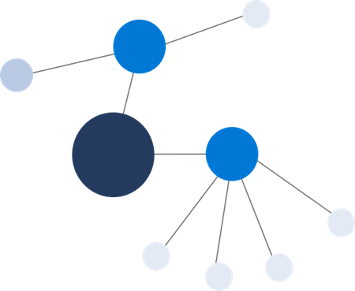
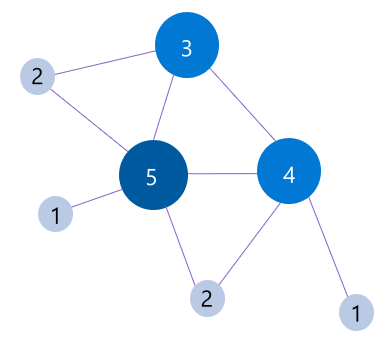
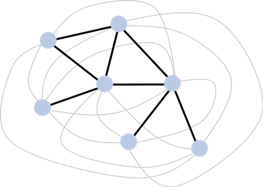

---
# Metadata Sample
# required metadata

ROBOTS: NOINDEX,NOFOLLOW
title: Metric calculations for Organizational Network Analysis Azure template
description: Learn how the metrics are calculated for the Organizational Network Analysis Azure Template for Workplace Analytics
author: madehmer
ms.author: v-midehm
ms.topic: article
localization_priority: normal 
ms.prod: wpa
ms.collection: M365-analytics
manager: scott.ruble
audience: Admin
---
# Metric calculations for the Organizational Network Analysis Azure template

_This template is only available as part of a Microsoft service engagement._

The Organizational Network Analysis Azure template for Workplace Analytics has a variety of metrics to help you visualize and analyze formal and informal relationships within your organization.

You can apply the following node sizing options to change how the data is measured and shown in the template graphs. The following shows the measures (metrics) available in the *Combined View* of a network graph.

## Weighted and directed calculations

All the network analysis metrics are calculated as *weighted* (based on the strength of connections between people or groups, which are not the same for everyone) and *directed* graphs (because a person can give time to their colleagues without receiving time from them). These calculations more accurately represents the interactions between people and individuals within the company.

These metrics can be computed on an individual- and on a group-level basis. The individual metrics apply to a single person (de-identified), while the group metrics apply to a specific set of people, such as a department within the organization.

The interpretation of the metrics for individuals and groups is the same. For example:

* If a person has a high Reach Index, it indicates the person is closer to everyone in the network than those with lower scores.
* If a group has a high Reach Index, it indicates the group is closer to everyone in the network than other groups with lower scores.

It's important to note that the Reach Index scores are not simply the average (or median, maximum, minimum) of the scores of the individuals within the group. They are the actual scores of the group. In some cases, the two may be equal but that's generally not the case.

A simple example of this is a water molecule, which is made up of two hydrogen atoms and one oxygen atom. If you take the properties of hydrogen and oxygen (both gases) and average them together, it won't generate the properties of a water molecule. Just like atoms and molecules, how individuals are connected within a group in an organization makes the properties of the group different than the average properties of the individuals within the group. For these calculations, the template generates the properties of the group, which depends on the network structure. You can generate summary statistics of individuals within the group from the individual level metrics.

For more overview, general information about these network measures, see the [Wikipedia Centrality article](https://en.wikipedia.org/wiki/Centrality).

## Boundary Spanning

Based on a defined group, Boundary Spanning measures an employee’s collaboration with members of other groups, with a boost for the diversity of their connections (number of groups). This does not consider ties inside their own group.

It measures the extent to which employees act as representatives of their group across the organization. Depending on the direction of the relationships, it can indicate resources to other functions, or cross-functional liaisons.

* **Employee level**: Boundary Spanning is defined as the geometric mean between the total collaboration time a person gave to those outside of their group and the total number of unique groups this same person collaborated with.

* **Group level**: The definition is the same for groups as for employees, except that the totals represent a group instead of a person. It's the geometric mean between the total collaboration time a specified group spent with people outside its own group and the total number of unique, external groups that the group collaborated with.

The following is an example of a simplified Boundary Spanning network graph.

## Bridging Index

Bridging Index is the number of times a person or group is on the most probable path of information flow between two other people or groups. Meaning these nodes represent the potential control over the flow of information in your organization.

Information flow through a network is often characterized by random-walk betweenness measures, which do not limit the flow of information through a network to the shortest paths. The traditional definition of current-flow bridging is computationally expensive. As such, this template uses a more computationally efficient measure of the importance score of an edge and the probability that information visiting an edge through a node will stay at the edge.

* **Employee level**: The Bridging Index calculates the importance scores for all edges in the network and then sums up the importance scores for edges incident to the employee of interest.

  When comparing the average across aggregated employees, you need to normalize this measure by the size of each person’s group. You can either divide by the group’s maximum, or by the adjusted group size: [(n-1)*(n-2)]/2. For groups, use the group level measures instead.

* **Group level**: At a group level, the Bridging Index sums the importance scores of a group’s incident edges, where the importance score of edges is the same for both employee and group level metrics. As such, we calculate the importance scores for all edges in the network and then sum up the importance scores for edges incident to the group of interest.

The following is an example of a simplified Bridging Index network graph.

## Degrees

Degrees is based on the number of edges connected to a node. The overall degree is the number of incoming and outgoing edges connected to a node. The Indegree centrality is the number of incoming edges. The Outdegree centrality is the number of outgoing edges from the node.

Degrees measures the degrees (number of links) of all nodes in the graph, which does not count any self-links (links that have the same node at both ends). Where there are multiple links between two nodes, each link is counted.

* **Employee level**: These are all calculated with [GraphX by Apache Spark](https://spark.apache.org/graphx/).

* **Group level**: The group degree centrality is the number of nodes outside the group that are connected to members of the group. The normalized group degrees is calculated as:
 
  **Degrees** = |**N**(**C**)|/(|**V**|-|**D**|)

   Where |**N**(**C**)| is the number of unique nodes which are not in **group C** but are adjacent to a member of **C**. And |**V**| is the number of nodes in the network and |**D**| is the number of nodes in group C. You can apply this same formula  to calculate indegree and outdegree measures by considering only “indegree” nodes or “outdegree” nodes.

The following is an example of a simplified Degrees network graph.

## Density

Density measures the number of actual connections out of the number of possible connections within a network or subgroup.

Higher density indicates higher levels of connectivity. Large groups tend to have small values since it’s much harder for everyone to connect with everyone else. Be careful comparing across groups. Proportion of possible intra-community edge weight based on each node’s max edge weight. Higher density scores represent a better inwardly-connected community.

This measure uses directionality, which means the density between group A and group B will only count the interactions that went from A to B, but not those interactions that went from B to A. This also means that the densities between groups will vary depending on whether the density is from Group A to Group B or from Group B to Group A. In other words, the density matrix is not symmetrical.

The following table depicts the density score within and across the respective groups, where:

 **Density** = **Actual connections**/**Potential connections**

The following is an example of a simplified Density network graph.

## Influence Index

Influence Index as a centrality measure in social networks can be used as a measure of a node’s potential influence on opinions of the network or as an estimate of social status.  Basically, Influence Index counts the number and quality of edges coming into a node.  

* **Employee level**: The calculations use the relative collaboration time between individuals as the weights of the edges in our determination of PageRank for a node.

* **Group level**: For group metrics, the Influence Index is the number and quality of edges coming into the group. Intra-group connections do not contribute to the Influence Index for the group. The network is collapsed into group nodes where the edge weights between groups is the sum of the individual node weights connecting the two groups.  This group graph then forms a new adjacency matrix A_G which is fed into the original Influence Index algorithm described in the previous section.

The following is an example of a simplified Influence Index network graph.

## Reach Index

Reach Index measures how close a node is to all other nodes in the network. It was originally defined as the inverse of a node’s farness, where farness is the sum of the distances from the node to all the other nodes in the network.

This measure requires the network to be fully connected, which means that each node can reach all other nodes in the network. This assumption is not always true in directed graphs and never true for disconnected graphs. Accordingly, we make several modifications to our calculation of closeness because of the directed nature (and possibly disconnected as well) of our social network graphs.

* **Employee level**: In a fully connected graph, where there is a path from any node to any other node, closeness is calculated as the reciprocal of "farness" (for example: 1/farness). The farness of a node is defined as the sum of the distances to each of the other nodes.

* **Group level**: The group equation is the same as the employee level one. Essentially, the group closeness only considers the distances from nodes inside the group to nodes outside of the group. Within group distances are ignored and only the shortest paths between nodes are considered. It is normalized by the number of nodes outside of the source node’s group. Within group distances are ignored [1]. Again, we consider only the shortest paths between nodes. It is normalized by the number of nodes outside of the source node’s group C.

This value will be between 0 and 1 and usually larger than the reach of individual nodes, due to higher connectivity. Reach index values do not typically have large separation among the top ranked members. This means that those nodes highest in reach are all quite similar to each other in how they can connect to the rest of the network.

The following is an example of a simplified Reach Index network graph.

## Related topics

* [Organizational Network Analysis Azure Template](./organization-network-analysis.md)
* [Workplace Analytics Azure Templates overview](./overview.md)
* [What's new in Workplace Analytics Azure Templates](./release-notes.md)
* [Deploy and configure Workplace Analytics Azure Templates](./deploy-configure.md)