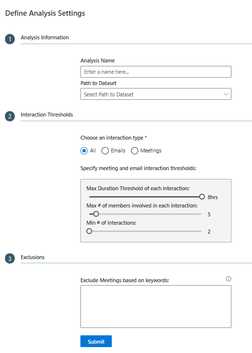
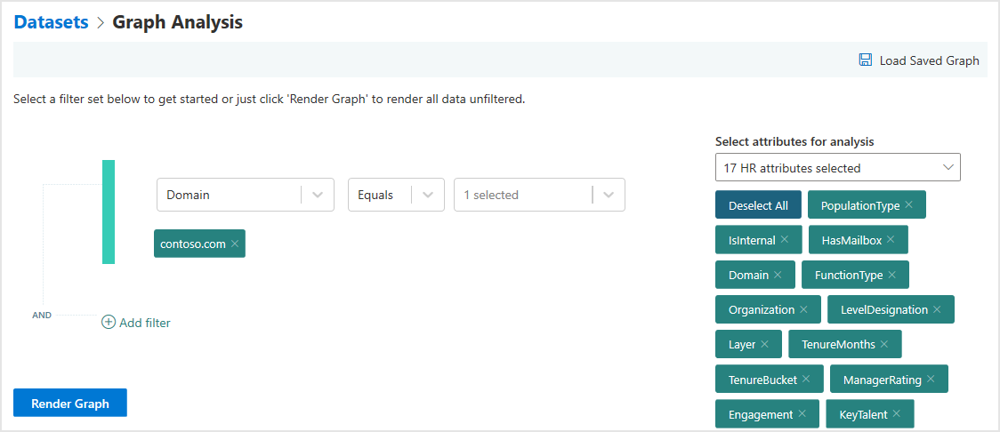

---
# Metadata Sample
# required metadata

ROBOTS: NOINDEX,NOFOLLOW
title: Organizational Network Analysis Azure Template for Workplace Analytics 
description: Learn about the Organizational Network Analysis Azure Template for Workplace Analytics and how to use it for advanced data analysis
author: madehmer
ms.author: v-midehm
ms.topic: article
localization_priority: normal 
ms.prod: wpa
ms.collection: M365-analytics
manager: scott.ruble
audience: Admin
---
# Organizational Network Analysis Azure Template for Workplace Analytics

_These templates are only available as part of a Microsoft service engagement._

Workplace Analytics Azure Templates include the Organizational Network Analysis template that enables you to visualize connections within your organization, pinpoint collaboration patterns, and drive change.

Workplace Analytics has several metrics to help you visualize and analyze formal and informal relationships within your organization. This analysis can help you shape a business strategy that improves communication, making your business more effective and sustainable.

## To add new network analysis

1. In Workplace Analytics Azure Templates, select **Organizational Network Analysis**.
2. On the **Organizational Network Analysis** page, select **Add New Analysis** at top right.
3. In **Define Analysis Settings**, enter a name and select a path to the dataset for analysis.

   

4. In **Interaction Thresholds**, select the following.

   * **Choose an interaction type**: Select what you want to analyze in the dataset, either email, meeting, or all.
   * **Max Duration Threshold of each interaction**: Select the maximum number of hours for each interaction.
   * **Max # of members involved in each interaction**: Select the maximum number of people involved in each interaction.
   * **Min # of interactions**: Select the minimum number of interactions between the selected groups or people.

5. Optionally, in **Exclusions**, enter one or more terms separated by a comma to exclude meetings with these keywords in the meeting subject line from this analysis.
6. Optionally, select one or more filters for the graph and which attributes you want to analyze. By default, all available attributes are selected. The available filters match up to the HR attributes included in the imported [organizational data](../setup/prepare-organizational-data.md##attribute-reference) from Workplace Analytics. For example, Domain and FunctionType are HR attributes, as shown in the following graphic.

   

7. Select **Render Graph**. Based on the data size, it might take a few minutes for the graph to appear.
8. At top left of the graph, select the start and end of the date range for this analysis, and then select **Apply** to update the graph view.

   

9. Use the following options to change, save, or download the current graph view.

   Option |Name |Description
   ------------|--------------|------------
   | No Measure | Change how the data is measured and shown in the graph based on the Node Sizing option you choose.
   | Show or Hide Legend  | Opens or closes the legend of assigned node colors for the HR attribute shown in the graph.
    | Link Color |Select a different color for the line links shown in the graph.
    | Dataset Parameters |Choose to view the network parameter details that you set for the selected dataset.
   | Network View  | Change how the graph shows the network, which you can view in either the **Force-directed**, **Lens**, **Organic**, **Structural**, or **Tweak** layout.
    |Combined View | Change the graph view to Combined View, which prompts you to select an HR attribute meeting metric to display the nodes for , such as FunctionType.
    | Change Node Colors | You can select to change the color of any of the nodes shown in the graph.
    | Change Settings |Scales the thickness or color darkness of the link lines. You can also use this to turn node labels and tool tips on or off.
    | Filter by HR attributes |Change the filters selected for the rendered graph.
    | View as Table |Choose to see a table view of the graph data.
    | Save Graph |Choose to save this graph as shown in the template to load and view later.

10. Use the **Define Analysis** option to set the Network analysis options, such as defining the network boundary filters and the level of employee and group level metrics.

## To load and view a saved graph

1. On the **Organizational Network Analysis** page, select the name of the analysis in the table.
2. At the top right of the **Graph Analysis** page, select **Load Saved Graph**.
3. Select the name of the graph that you want to view.
4. Additional options on this page:

   * When the **Status** is a green check mark, the graph analysis was successfully saved and can be viewed.
   * If the analysis fails with the **Status** of a red x: 
     * Select the **Undo** icon to revert to the last successfully saved version.
     * Select the **Job Details** (i) icon next to Status to view details and see what might've caused the failure.
   * Select a table column heading, such as Name or Submitted, to sort by it.
   * Select the **Download Metrics** icon to download a .csv file with the person and group metrics in the saved graph analysis, including the selected date range and other selected options. For example, Interconnectedness will have multiple values based on the attributes selected for the graph.
   * Select the **Dataset Parameters** icon next to the name to view them for the analysis in that row.
   * Select the **Delete Dataset** (trashcan) icon to delete the analysis from the list.

## Node Sizing

You can apply the following node sizing options to change how the data is measured and shown in the graph.

### Number of employees

This option is only available in Combined View. The node size is based on the number of people in that particular group. The larger node sizes represent the nodes with the larger number of people in that network.

### Betweenness

Betweenness measures how much of a key connector a person or group (node) is in the network. This is calculated by finding the shortest paths between all nodes to all other nodes in the network and finding the number of times a node appears on the shortest path. The more times a node appears on the shortest path between other nodes, the more of a key connector that node is and therefore the higher the node’s betweenness score is.

### Boundary Spanning

This option is only available in ?? View. Boundary Spanning is a measure of...

### Closeness

Closeness measures the closeness between nodes in a network, based on their ability to reach them. It then calculates each node’s shortest path to every other node, then assigns each node a score based on the sum of all the paths. Nodes with a high closeness value have a lower distance to all other nodes and therefore are efficient broadcasters of information.

### Degrees

Degrees measures the highest number of links to other nodes within the network. Nodes with a high degree of links are those people or groups who have the best connections to others in the network. These people or groups can be key influencers or might just be strategically important for communication.

### Density

Density measures cohesion within groups and across groups by density, which is a table view. As shown in the following graphic, the table depicts the density score within and across the respective groups, where:

 **Density** = **Actual connections**/**Potential connections**

### Eigen Centrality

Eigen Centrality is a measure of influence that considers the number of links each person or group (node) has and the number of links their connections have, and so on throughout the network. The larger nodes represent the people or groups with high centrality and can be key influencers in their network.
As shown in the following graphic, Engineering, R&D, and Sales are key influencers that connect all the other groups.

### Influence Index

This option is only available in ?? View. Influence Index is a measure of...

### Interconnectedness

This option is only available in Node View. Interconnectedness is a measure of how diverse a node’s connections are. The higher the interconnection for a node, the more that node’s connections come from other nodes. The nodes with high interconnection can be good ambassadors and help drive collaboration for the intersecting nodes.

### Graph notes

* **Insufficient group size** - If one or more nodes represent groups that are smaller than the set Minimum Group Size, they're combined and listed as an insufficient group (such as in the color node list) and won't show in the graph.

* **Delete a node** - If you want to exclude a node from the graph, you can use the filter options or select the node in the graph to highlight it, and then press **Delete** (on your keyboard). Before saving the graph, you can right-click in the graph, and then select **Show Hidden** to undo a delete.

## Related topics

* [Workplace Analytics Azure Templates overview](./overview.md)
* [What's new in Workplace Analytics Azure Templates](./release-notes.md)
* [Deploy and configure Workplace Analytics Azure Templates](./deploy-configure.md)
* [Topic Analysis Azure Template](./topic-analysis.md)
* [Process Explorer Azure Template](./process-explorer.md)
