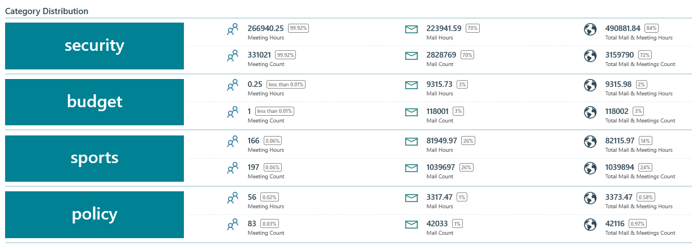
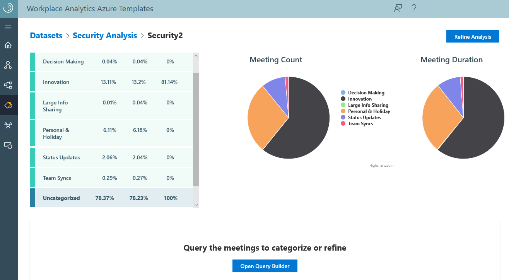
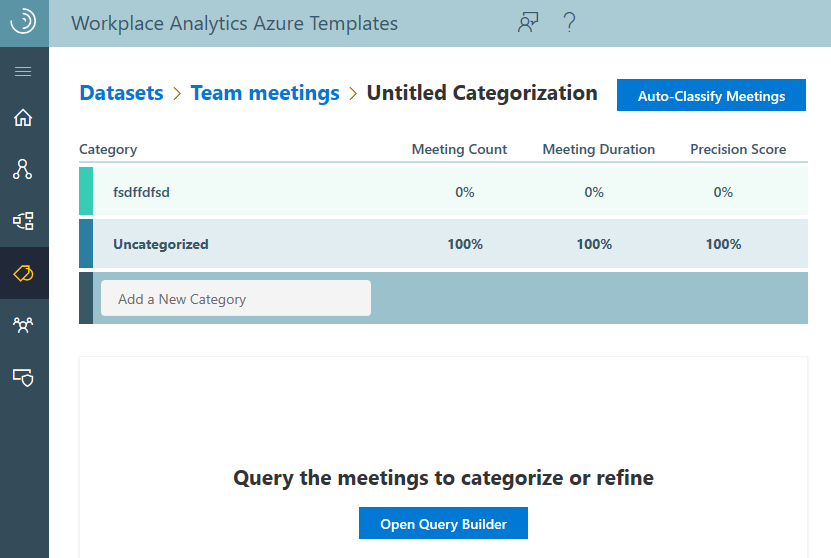
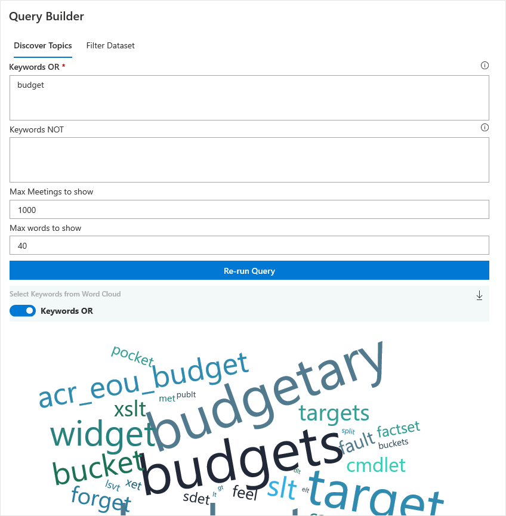

---
# Metadata Sample
# required metadata

ROBOTS: NOINDEX,NOFOLLOW
title: Process Explorer Azure Template for Workplace Analytics 
description: Learn about the Process Explorer Azure Template for Workplace Analytics and how to use it
author: madehmer
ms.author: v-midehm
ms.date: 05/01/2019
ms.topic: article
localization_priority: normal 
ms.prod: wpa
ms.collection: M365-analytics
manager: scott.ruble
audience: Admin
---

# Process Explorer Azure Template for Workplace Analytics

_These templates are only available as part of a Microsoft service engagement._

Workplace Analytics Azure Templates includes the Process Explorer template that helps you understand where your organization or team is investing or expending valuable time. 

You can use this template to categorize processes, projects, meetings, and other activities. You can either upload a .csv dataset for meeting activity or a dataset from a blob storage location for meeting and email activity.

After you upload a dataset, you can use template tools to view the data by categories with visual charts and lists, as shown in the following graphic. You can also use the query builder to view and save the data using a word cloud or help train the template to categorize the dataset for you.

   

Depending on the dataset, you can also select **Refine Analysis** to create a copy of the selected analysis and add one or more new categories for more in-depth analysis focused on a subset of the data.

   

## To add a new dataset

1. In Workplace Analytics Azure Templates, select **Process Explorer**.
2. Select **Add New Dataset** (top right).
3. For **Select Dataset Type**, select either a .csv file to upload or a blob storage location, and then select **Next**. You can use a .csv file to upload meeting data or if you want to upload email and meeting data, use the blob storage option.

   

4. Type a dataset name, locate and select the .csv file or blob storage location, and then select **Upload Dataset** (.csv) or **Run** (blob storage).
5. When prompted, select **OK**. The upload will take a few minutes to complete.
6. After the upload succeeds, the dataset list will include this new one.

## To add categories for analysis

1. On the **Process Explorer** page, select the dataset name from the list.
2. For new datasets, you're prompted to enter a classification title and set the probability threshold for the first category. Each dataset requires at least one category for analysis, which is how you want to categorize the meetings and/or emails by.
3. Type a new category to add to the end of the list or select **Add New Categorization** to add additional categories for analysis.

   

4. For .csv datasets, you can also select to **auto-categorize** the meetings in the dataset. You can now view information about the dataset or follow the steps in the next section to create and export queries.
5. Or for blob storage, the meetings and emails in this dataset are listed below the list of categories. To help train the template to auto-classify or auto-categorize meetings and emails for current and future analysis, select the category from the list, and then select the check box next to each meeting or email that you want to include in that category.
6. After a complete sample of related emails/meetings are selected, select **Apply**, and then select **Auto-classify** and the template will use this sample selection to more accurately categorize the whole dataset for current and future analysis. You can now information about the dataset or follow the steps in the next section to create and export queries.

## To view, create queries, and export analysis

1. On the **Process Explorer** page, select the dataset name from the list.
2. Select the analysis name from the list.
3. On the analysis page, depending on the dataset (blob storage or .csv), you can do one or more of the following:

   * Type a new category to add at the end of the category list.
   * Hover your cursor over the category in the list to view and select the **delete** icon to remove it.
   * Select **Refine Analysis** to create a copy of the selected analysis and add one or more new categories for more in-depth analysis focused on a subset of the data.
   * Select **Open Query Builder** to create a query with the dataset.

4. To search for keywords in meeting and/or email subjects or titles, enter one or more keywords, separated by commas, in one of the **Keyword** boxes.

   * To search for word phrases, separate the phrase with an underline (for example **budget_manager**).
   * To search for word phrases in any order, separate the words with spaces (for example **budget finance manager**).
   * **Keywords OR** includes titles with words that contain any of the words entered or any combination of these words (phrases separated with spaces).
   * **Keywords NOT** excludes titles with these words from the search and data analysis.

5. Select **Run query**.
6. In the **Word Cloud**, you can select other keywords to add to the **Keywords OR** box, and then select **Re-run Query** to update the cloud view. For example, the following shows a word cloud for meetings and emails relating to budget.

   

7. You can then select to export the query as a .csv file for further analysis.

## Related topics

* [Workplace Analytics Azure Templates overview](./overview.md)
* [Deploy and configure Workplace Analytics Azure Templates](./deploy-configure.md)