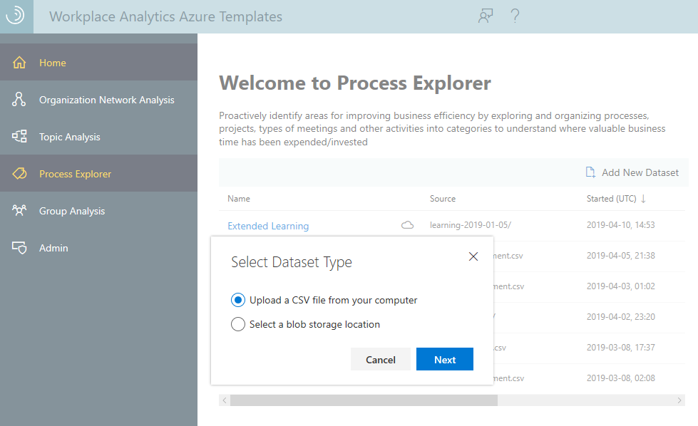
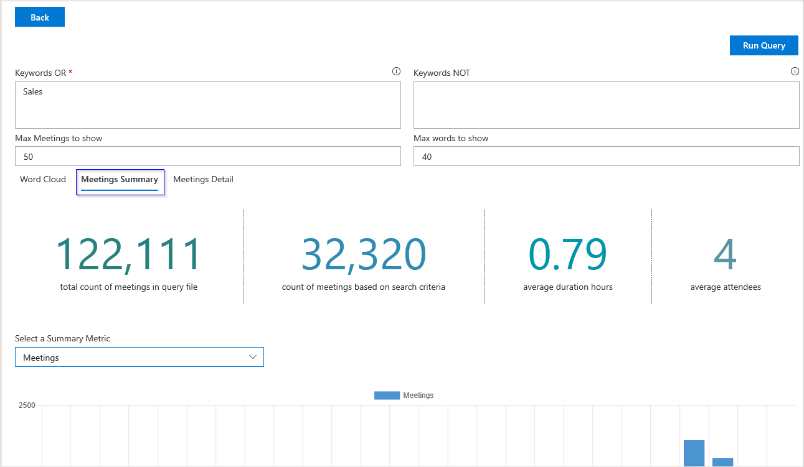

---
# Metadata Sample
# required metadata

ROBOTS: NOINDEX,NOFOLLOW
title: Process Explorer Azure Template for Workplace Analytics 
description: Learn about the Process Explorer Azure Template for Workplace Analytics and how to use it
author: madehmer
ms.author: v-midehm
ms.date: 04/18/2019
ms.topic: article
localization_priority: normal 
ms.prod: wpa
ms.collection: M365-analytics
manager: scott.ruble
audience: Admin
---

# Process Explorer Azure Template for Workplace Analytics

_These templates are only available as part of a Microsoft service engagement._

Workplace Analytics Azure Templates includes the Process Explorer template that helps you understand where your organization or team is investing or expending valuable time. You can use this template to categorize processes, projects, meetings, and other activities. 

## To add a new dataset

1. In Workplace Analytics Azure Templates, select **Process Explorer**.
2. Select **Add New Dataset** (top right), and then locate and select the dataset you want to import and analyze. 
3. For **Select Dataset Type**, select either a .csv file to upload or a blob storage location.

   

4. After the upload succeeds, the dataset list will include this new dataset. 

## To add categories for analysis

1. On the **Process Explorer** page, select the name of the new dataset.
2. For new datasets, you're prompted to enter a classification title and set the probability threshold for the first category. Each dataset requires at least one category for analysis.
3. If prompted, you can select to **Auto-Classify Meetings** or type a new category to add to a query for this dataset.
4. Select **Open Query Builder** to see the new category and its current status. You can also select:
   * The dataset parameters icon to view parameter details
   * The information (i) icon to view the job details
   * The delete (trash) icon to remove a category
5. Select **Add New Categorization** to add additional categories for analysis.

## To view analysis

1. Select the dataset name from the list.
2. Select the category name from the list.
3. 
4. To search for keywords in meeting subjects or titles, enter one or more keywords, separated by commas, in one of the **Keyword** boxes. To search for word phrases, separate the phrase with an underline (for example **product_marketing**). Or to search for word phrases in any order, separate the words with spaces (for example **product marketing managers**).

   * **Keywords OR**: Includes meeting titles with words that contain any of the words entered or any combination of these words (phrases separated with spaces).
   * **Keywords NOT**: Meeting titles with these words are excluded from the search and data analysis.
5. Select **Run query**.
6. In the **Word Cloud**, you can select other keywords to add to the **Keywords OR** box, and then select **Run query** again to update the cloud view to include the additional words you added, as shown in the following graphic.

   

7. You can then select **Meetings Summary** to view key meeting data points about the following metrics.

   Meetings Summary metrics |Description
   ------------------------|------------
   Total count of meetings in query file (Meetings) | Total number of meetings that are in the query file.
   Count of meetings based on search criteria | Total number of meetings that match the search criteria.
   Average duration hours | The average number of hours for the meeting length for the meetings in the search criteria.
   Average attendees | The average number of people who attended the meetings that match the search criteria.
   Summary metrics | Based on the organizational data imported from Workplace Analytics. For details, see [Meeting metrics](../use/metric-definitions.md#meeting-metrics).

   The following diagram shows an example of the metrics available on the **Meetings Summary** page. You can select a **Summary metric** to change what data shows in the chart.
   

8. You can select **Meetings Detail** to view the available meeting metrics in a table or export them as a .csv file.

   

## Related topics

* [Workplace Analytics Azure Templates overview](./overview.md)
* [Deploy and configure Workplace Analytics Azure Templates](./deploy-configure.md)