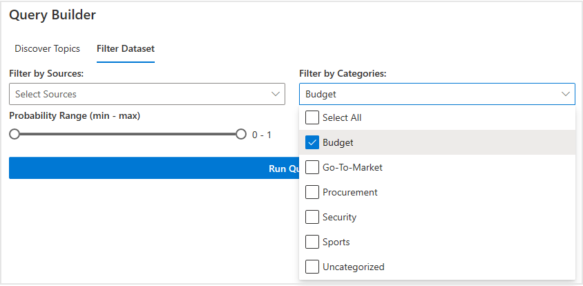

---
# Metadata Sample
# required metadata

ROBOTS: NOINDEX,NOFOLLOW
title: Process Explorer Azure Template for Workplace Analytics 
description: Learn about the Process Explorer Azure Template for Workplace Analytics and how to use it
author: madehmer
ms.author: v-midehm
ms.date: 07/18/2019
ms.topic: article
localization_priority: normal 
ms.prod: wpa
ms.collection: M365-analytics
manager: scott.ruble
audience: Admin
---

# Process Explorer Azure Template for Workplace Analytics

_These templates are only available as part of a Microsoft service engagement._

Workplace Analytics Azure Templates includes the Process Explorer template that helps you understand where your organization or team is investing or expending valuable time.

You can use Process Explorer to categorize processes, projects, meetings, and other activities. You can either upload a .csv dataset for meeting activity or connect to a blob storage location for meeting and email activity.

After you upload a dataset, you can use the word cloud help you decide what categories to add for analysis by viewing words in the meeting activity. You can select category names or phrases from the word cloud to add for analysis.

After you categorize a good sample of meetings into the specified categories, you can:

* Select to **Auto-Categorize Full Dataset** based on your sample categorization.
* View meeting data based on those categories with visual charts and lists, as shown in the following graphic.
* Use the **Refine Categorization** option to create a copy of the selected analysis and add one or more new categories for more in-depth analysis focused on a subset of the data.

   

## To add a new dataset

1. In Workplace Analytics Azure Templates, select **Process Explorer**.
2. Select **Add New Dataset** (top right).
3. For **Select Dataset Type**, select either a .csv file to upload or a blob storage location, and then select **Next**. You can use a .csv file to upload meeting data or if you want to upload email and meeting data, use the blob storage option.

   

4. Type a dataset name, locate and select the .csv file or blob storage location, and then select **Upload Dataset** (.csv) or **Run** (blob storage).
5. When prompted, select **OK**. The upload will take a few minutes to complete.
6. After the upload succeeds, the list will include the new dataset.

## To categorize meetings for analysis

1. On the **Process Explorer** page, select the dataset name from the list.
2. For new datasets, you're prompted to enter a new categorization and set the probability threshold for the first category. The threshold option is how likely a meeting must be in a category before it's automatically assigned to that category. Each dataset requires at least one category for analysis, which is how you want to categorize the meetings.
3. In **Query Builder** > **Discover Topics**, you can select one or more keywords from the Word cloud or type them, separated by commas, in one of the applicable **Keyword** boxes to categorize the data you want to analyze.

     

   * To search for word phrases, separate the phrase with an underline (for example **budget_manager**).
   * To search for word phrases in any order, separate the words with spaces (for example **budget finance manager**).
   * Use **Keywords OR** to include titles with words that contain any of the words entered or any combination of these words (phrases separated with spaces).
   * Use **Keywords NOT** to exclude titles with these words from the search and data analysis.
   * Use **Filter Meetings** to filter by analyst and/or model, and by one or more categories, such as budget, as shown in the following graphic.
   * You can also adjust the probability range to filter the word cloud and meeting list.

     

4. Select **Run query**.
5. After the data is queried, you can:

   * Use **Add a New Category** to add any additional categories needed for grouping the uncategorized meetings into.
   * Select a category, select the check box next to a good sample of related meetings, and then select **Apply** to add them to that category. This will help train the system for auto-categorization of the whole dataset.

      

   * After you categorize a good sample of related meetings for all the categories that you want to evaluate, you can select **Auto-Categorize Full Dataset** and the template will automatically assign a category to all meetings in the whole dataset based on the sample categorization.

      

   > [!Note]
   > After you use Auto-Categorize Full Dataset on a dataset that’s source is a .csv file, the analysis changes to read-only and you cannot add new or change categories or re-categorize any of the meeting data in this dataset for this analysis. If you want to change the categories or how meetings are categorized, you can use Refine Categorization or just create new analysis by repeating these steps. 

6. You can then select **Refine Categorization** to create a copy of the selected analysis and add one or more new categories for more in-depth analysis focused on a subset of the data.

## Email activity analysis

You can only analyze email activity when the data source is blob storage and after you have categorized a good sample of meeting activity into the categories you want to analyze.

## Related topics

* [Workplace Analytics Azure Templates overview](./overview.md)
* [Deploy and configure Workplace Analytics Azure Templates](./deploy-configure.md)
